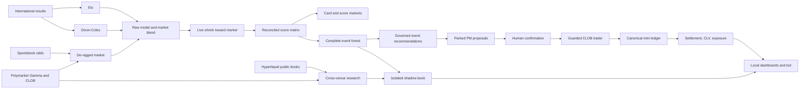

# World Cup Alpha architecture

**Reconciled:** 2026-07-17 against the current worktree, current generated
feeds, deployment definitions, and focused event/shadow/dominance tests.

This document describes stable component boundaries. Time-sensitive tournament
facts and unverified production runtime state belong in
[`docs/CURRENT_STATE.md`](docs/CURRENT_STATE.md). Operator commands belong in
[`docs/OPERATIONS.md`](docs/OPERATIONS.md).

## 1. System boundaries

World Cup Alpha has four deliberately different planes:

1. **Forecasting:** Elo, Dixon-Coles, market de-vigging, score-matrix
   reconciliation, and tournament simulation.
2. **Decision support:** cards, event-market recommendations, advancement,
   exposure, promos, and CLV/calibration reporting.
3. **Execution and accounting:** human-confirmed Polymarket execution,
   manually placed sportsbook trades, the canonical ledger, settlement, and
   closing-price capture.
4. **Research:** the event forest, shadow scoreboards, the isolated multi-venue
   shadow book, microstructure studies, and Hyperliquid/Polymarket comparisons.

Research outputs do not become live execution merely because they are visible
on the same localhost site.



## 2. Machine topology

| Node | Role | Durable facts |
|---|---|---|
| MacBook | Development and public-market gateway | Checkout at `~/Desktop/Coding/World Cup Alpha`; PM requires NordVPN; public HL reads are performed here; local DBs are non-canonical. |
| Mac mini | Production | Checkout at `~/World-Cup-26`; owns `data/wca.db`, production launchd jobs, Telegram bots, backups, and the primary publisher. Use `andrewdoherty@Drews-Mac-mini.local`, not the stale numeric IP. |
| GitHub `main` | Deploy bus and tracked-feed transport | Code is merged through PRs; the mini autopulls every five minutes. Generated feeds are also committed, so concurrent writers require the `merge=freshest` driver. |
| Localhost sites | Operator surfaces | `site/` on port 8000 and `site-analytics/` on port 8001. Hosted deployment is not supported. |

The design treats the Mac mini as Polymarket-blind: the last verified native
route failed at TLS. PM-dependent builders run on the MacBook or another
verified PM-capable host and move non-secret public feeds through git.
Hyperliquid public reads have worked from the MacBook without the PM VPN, but
reachability must be checked per session and is not assumed on the mini.

## 3. Forecasting pipeline

### 3.1 Inputs

- `data/raw/martj42_cleaned.csv` and
  `data/processed/wc2026_results.json`: match-result spine.
- TheOddsAPI and read-only exchange adapters: sportsbook prices and closes.
- Polymarket Gamma/CLOB: market discovery, bid/ask, event prices, advancement,
  and public trade/order-flow data.
- Optional StatsBomb/player assets: props and research; absence must degrade to
  unknown, not a fabricated estimate.

### 3.2 Models

- `src/wca/models/elo.py`: international Elo and match outcome probabilities.
- `src/wca/models/dixon_coles.py`: time-decayed sparse-team goal model.
- `src/wca/card.py`: combines Elo, Dixon-Coles, and de-vigged market prices.
- `src/wca/models/scores.py`: reconciles the goal matrix exactly to the chosen
  1X2 probabilities before deriving score, totals, BTTS, spread, and team-total
  markets.
- `src/wca/sim/tournament2026.py`: official 48-team bracket simulation with
  played results fixed rather than replayed.

The live match line is the shrunk blend; `model_raw` remains available for
calibration. `WCA_SHRINK_LIVE=0` is the rollback switch. Model changes remain
shadow-first until out-of-sample evidence supports promotion.

### 3.3 Selection and sizing

`src/wca/selection.py` is the ranking source of truth:

- moneyline: model probability `>= 0.50`;
- mid: `0.25 <= p < 0.50`;
- longshot: `p < 0.25`, with cash stake forced to zero;
- match markets: probability bucket, then EV;
- multi-week futures: probability bucket, further-out/deeper stage, then EV.

`src/wca/card.py::full_pools` represents one combined bankroll: GBP 3,000 plus
realised GBP-book P&L plus realised PM P&L converted at USD 1.33/GBP. It is
expressed in the venue currency and sized at quarter Kelly. It is not a GBP
3,000 pot per venue. `WCA_FULL_POOLS=0` restores the legacy split for rollback.

Static execution caps are independent guardrails, not dynamic bankroll
outputs. Current defaults in `src/wca/pm/trader.py` are USD 160/order,
USD 1,000/day, and USD 400 for a de-risking cash-out; the fire wrapper has an
absolute USD 200 backstop.

## 4. Complete event forest

### 4.1 Builder

`scripts/wca_event_markets.py` is the complete PM match-event builder. For each
upcoming persisted fixture it:

1. loads the card's exact blended 1X2 and persisted lambdas;
2. refits the production Dixon-Coles path and verifies lambda agreement;
3. enumerates PM fixture events through Gamma, supplementing pagination with
   fixture search;
4. reads CLOB top-of-book when available;
5. classifies every discovered market without inventing unsupported model
   values;
6. writes `site/forest_data.json` and governed
   `site/event_market_recs.json`.

The builder refuses to overwrite an existing priced forest when a PM-blind run
captures zero prices, unless a human explicitly passes `--force-blind`.

### 4.2 Market families

The forest can represent:

- 1X2;
- total goals at arbitrary half-lines;
- BTTS;
- spreads and winning margins;
- team totals;
- exact scores and any-other-score;
- anytime scorer props;
- extra time and penalty-shootout questions;
- single-match team-to-advance;
- halftime and second-half results;
- first team to score;
- corners;
- first/second-half totals and BTTS;
- other discovered markets as honest market-only rows.

Model support is intentionally narrower than market coverage. Unsupported
corners, half markets, and miscellaneous contracts remain market-only. Exact
scores and scorer props are killed for cash. Totals under/lay signals retain a
documented poor historical result and are display-only. Every row includes its
settlement basis and forecast provenance.

### 4.3 Recommendation boundary

`src/wca/eventmarkets.py` converts priceable rows into a governed subset. It
applies PM fees, a net-edge floor, selection buckets, longshot no-cash,
quarter-Kelly sizing, static order caps, same-fixture correlation caps, and the
cash kill-list. The forest is broad observability; the recommendation feed is
the narrower decision surface.

The mini publisher preserves the complete feed and only rebuilds it when
`WCA_EVENT_MARKETS=1` on a PM-capable host. Legacy workflow builders still need
reconciliation so they cannot replace the full forest with a reduced feed.

## 5. Multi-venue shadow book

The shadow book on the current branch is an isolated forecasting laboratory:

- database: `data/shadow_book.db`, never `data/wca.db`;
- engine: `src/wca/shadowbook.py`;
- CLI: `scripts/wca_shadow_book.py`;
- guarded cycle: `scripts/wca_shadow_book_cycle.sh`;
- report feed: `site/shadow_book.json`;
- audit UI: `site/shadow-book.html`;
- methodology: `docs/research/shadow_book_methodology.md`.

Each run records a source hash and policy version. Each market observation
stores venue, fixture, canonical market key, family, settlement basis,
instrument, price/depth fields, raw and calibrated forecasts, and provenance.
Every entry or abstention is recorded with its reason. Simulated positions are
kept separate from the live ledger and settle to 0, 0.5, or 1.

Decision modes are distinct:

- **production model:** fee-adjusted model edge, reliability-bin calibration,
  quarter Kelly, USD 40 position cap, and USD 160 model exposure per fixture;
- **market-prior exploration:** deterministic USD 1 paper positions for
  coverage, explicitly excluded from model-alpha claims;
- **cross venue:** independent relative-value observations and paired baskets,
  which fail closed on stale data or a gated settlement tail.

The cycle forces `PM_DRY_RUN=1` and removes the PM signing key. It invokes no
order endpoint. Adding the launchd definition to the repo does not activate it
on the mini; a human must run the installer after merge.

## 6. Generic HL/PM dominance bounds

The current worktree contains research math in `src/wca/hl/dominance.py`. It is
not an execution engine and is not yet tracked on the branch.

Let:

- `W` = the team wins in 90 minutes;
- `D` = the 90-minute result is a draw;
- `T` = the team wins the tie after extra time or penalties;
- `A` = the team advances.

The nested-contract identity is:

```text
A = W OR (D AND T)
P(A) = P(W) + P(D) * P(T | D)
```

This creates two directly purchasable, played-match coverage baskets:

1. `HL A-YES + PM W-NO` pays at least USD 1 in every played-match state and
   USD 2 when the team advances after a 90-minute draw.
2. `HL A-NO + PM W-YES + PM D-YES` pays at least USD 1 in every played-match
   state and USD 2 when the opponent advances after a 90-minute draw.

The candidate cost includes every ask, PM taker fee, supplied HL trading fee,
and a conservative HL settlement-fee deduction. A positive margin with an
unknown HL settlement fee is labelled `CANDIDATE_FEE_UNVERIFIED`, never
guaranteed arbitrage.

The identity does not erase contract text. Cancellation, no-result, deadline
gaps, co-champion rules, administrative decisions, and half-void payouts can
break the played-match coverage table. Depth and quote timestamps must also be
jointly executable. These checks are prerequisites to any promotion.

## 7. Execution and ledger

### 7.1 Venue boundaries

- Sportsbooks: recommendation and manual placement; screenshots can be parsed
  into a pending ledger confirmation.
- Polymarket: public reads and proposals are automatic; order submission is
  human-confirmed and guarded by `ClobTrader`.
- Betfair and Smarkets: read-only/reference paths; Betfair execution is a
  standing no-build decision.
- Hyperliquid: public-data research only; no signing or order path.

### 7.2 Polymarket chain

```text
model/feed -> proposal -> pm_parked -> Telegram /pm review
           -> human Y PM-n -> ClobTrader guardrails -> venue response
           -> fill telemetry and canonical ledger reconciliation
```

`PM_DRY_RUN` defaults safe in the guarded paths, but operators and agents must
still force it explicitly on the MacBook. The execution layer validates
allowlists, notional caps, daily spend, available balance, minimum order size,
and idempotency before a live request.

### 7.3 Canonical state

`data/wca.db` on the mini is the only canonical real-money ledger. Core tables
cover trades, settlement, closing prices/CLV, odds snapshots, parked and fired
PM orders, promotions, and operational telemetry. The low-level write boundary
is `src/wca/ledger/store.py`; reconciliation tools are shadow/detect-only unless
a human explicitly selects apply mode.

## 8. Scheduling and publishing

The Mac mini's current deployment definition includes KeepAlive daemons for the
operations bot, snapshotter, news, promos, and code conductor, plus interval
jobs for card builds, backups, proposal parking, closes, publishing, watchdogs,
position reconciliation, archives, PM drift, analytics, orderflow, player/prop
refresh, in-play ingest, and the shadow book.

Important properties:

- autopull runs every five minutes and restarts changed daemons;
- primary publish runs every 30 minutes and commits selected generated feeds;
- new/changed launchd definitions require a human installer run;
- the MacBook has separate feed-pull and positions-sync jobs;
- `merge=freshest` is configured per checkout, not by `.gitattributes` alone;
- generated feeds can race between mini, CI, and manual PM-capable builders.

## 9. Source-of-truth map

| Concern | Source of truth |
|---|---|
| Agent rules | `AGENTS.md` |
| Current dated state | `docs/CURRENT_STATE.md` |
| Operations | `docs/OPERATIONS.md` |
| Ranking/no-cash | `src/wca/selection.py` |
| Combined bankroll | `src/wca/card.py::full_pools` |
| PM sizing primitives | `src/wca/markets/bankroll.py` |
| PM execution guards | `src/wca/pm/trader.py` |
| Ledger writes | `src/wca/ledger/store.py` |
| Complete event forest | `scripts/wca_event_markets.py` |
| Event recommendation policy | `src/wca/eventmarkets.py` |
| Shadow book | `src/wca/shadowbook.py` |
| HL matched-pair watcher | `src/wca/hl/xvenue.py` |
| Generic dominance bounds | `src/wca/hl/dominance.py` (current untracked research) |
| Production service definitions | `deploy/macmini/services.env` + `install.sh` |

## 10. Failure posture

- Missing data stays missing; no fabricated probabilities, results, prices, or
  settlement events.
- PM blindness must preserve the last priced event forest, not overwrite it.
- Stale cross-venue data creates abstentions, not positions.
- Divergent settlement creates a gated research row, not an arbitrage label.
- Failed position reconciliation creates review output, not an ambiguous write.
- Destructive mini recovery requires a backup and explicit human approval.
- No research result can clear the live-money gate without price capture, CLV,
  settlement automation, tested controls, and human approval.
