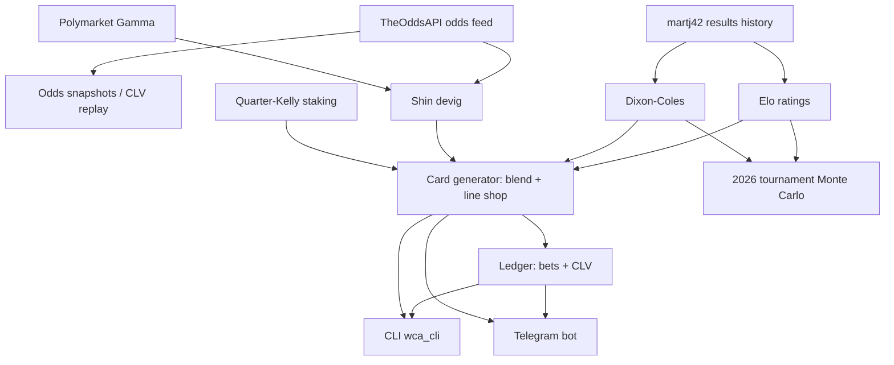

# World Cup Alpha

A quantitative betting **research platform and live operation** for the 2026 FIFA World Cup. Built from zero in the ~25 hours before the opening match; now running through the tournament. It tests one question with real money and pre-registered metrics: **can systematic +EV betting on international football be demonstrated — and measured honestly — across bookmakers and prediction markets?**

**Live dashboard:** https://fifa-world-cup-2026-betting-gamblin.vercel.app ([scores & markets](https://fifa-world-cup-2026-betting-gamblin.vercel.app/scores) · [under the hood](https://fifa-world-cup-2026-betting-gamblin.vercel.app/architecture))

Three bankroll pools: UK sportsbooks (£1,000 notional, CLV-gated ladder to £5,000), Polymarket ($1,310 USDC), Kalshi (planned). Recommendations-only at the sportsbooks; semi-automated with a human confirm gate on prediction markets.

<!-- WCA:STRUCTURE:START -->
## Project Structure Analytics

_Auto-generated by `scripts/wca_structure.py` on 2026-06-11. Do not edit this block by hand._



| Metric | Value |
| --- | --- |
| Modules (src + scripts, excl. __init__) | 42 |
| Code lines (LOC, total) | 19569 |
| LOC: wca (top-level) | 3268 |
| LOC: wca.data | 1405 |
| LOC: wca.models | 1404 |
| LOC: wca.markets | 518 |
| LOC: wca.ledger | 677 |
| LOC: wca.bot | 1302 |
| LOC: wca.sim | 1253 |
| LOC: scripts | 2213 |
| LOC: tests | 6882 |
| Tests (def test_) | 540 |
| Data sources | 3 |
| Model classes | 5 |
| Bot commands | 9 |

**Complexity index: 102.0** (modules + tests/10 + data sources × 2)
<!-- WCA:STRUCTURE:END -->

## Mission & KPIs (pre-registered)

1. **Closing-Line Value** — the primary KPI. Beating the close over a meaningful sample is the fastest honest evidence of edge; ROI at this stake count is noise.
2. **Calibration** — Brier / log-loss of the blend vs. the Shin-de-vigged market baseline. A model that can't beat the market's Brier score has no business staking on it.
3. **Bankroll** — lagging, variance-dominated confirmation only.

**Pre-registered pause rule:** if aggregate CLV is negative after ~50 settled-with-close bets, real-money model bets pause for diagnostic review. **Bankroll ladder:** the sportsbook pool starts at £1,000 notional and is promoted (£2,500 at 50 settled-with-close bets with positive CLV, £5,000 at 100) or demoted by the same evidence — wired into the card generator, not enforced by willpower.

## The system

### Models — with the evidence behind every default
- **International Elo** (World Football Elo conventions: importance-weighted K, goal-margin multiplier, host advantage) + ordered-logit draw model.
- **Time-decayed Dixon-Coles** with L2 shrinkage for 200+ sparse national teams. Deployed half-life **8y** — backtested across WC2018/WC2022/Euro+Copa2024 holdouts (211 matches); hl=4 wins by a non-decision-grade +0.0016 log-loss and the deployed Elo+DC blend is best *at* 8y ([backtest](docs/research/backtests/halflife.md)).
- **Market baseline**: Shin de-vig per book → consensus median.
- **Blend**: 25/25/50 Elo/DC/market. Fitted weights on real WC2022 closing odds (pulled via historical API) do **not** beat market-only with confidence (n=64, CI straddles zero) — so the prior stands, documented, until WC2026 group-stage data re-fits it ([backtest](docs/research/backtests/blend_weights.md)).
- **Scoreline engine**: DC score matrix reconciled exactly to the blended 1X2 → correct scores, O/U, BTTS that never contradict the headline card.
- **48-team Monte Carlo tournament simulator** (official R32 bracket + third-place allocation) → per-team advancement probabilities, compared against Polymarket stage markets.

### Decision & scanning
- **Card generator**: blend vs. best price across ~19 books, EV floor, quarter-Kelly stakes per pool with per-bet and daily exposure caps.
- **Derivative EV scanner** (`wca_event_ev`): BTTS / totals / DNB / alternate lines priced off the reconciled matrix vs. live books + Polymarket, commission- and fee-adjusted.
- **Arbitrage scanner** (`wca_arb`): cross-book, Polymarket-internal, and book-vs-PM — with a hard **settlement-key guard** so 90-minute markets are never "arbed" against ET/pens-inclusive ones (the classic fake-arb trap).
- **Promo/boost evaluation** as a first-class edge source (2-up early payout, super subs, odds boosts) — frequently the largest genuine +EV available to a small bankroll.

### Operations
- **Adaptive odds daemon** (`wca_snapshotd`): hourly idle → 5-min closing window → 3-min in-play, quota-aware with a hard reserve, never sleeps past a closing line. Snapshots feed the CLV ledger and the live line-movement charts.
- **Telegram bot**: `/card` `/scores` `/bets` `/summary` `/clv` + **betslip-screenshot ingestion** (Claude vision reads any slip → confirm → ledger) and a **Y/N confirm gate** for Polymarket orders. Multi-chat with an **admin gate**: money-touching actions are restricted to one user id; groups get read-only commands.
- **Auto-publishing**: every ledger write and every in-play polling cycle regenerates the site data and pushes — the public dashboard tracks the ledger with no manual steps.
- **Polymarket CLOB client** (no SDK): raw EIP-712 signing for EOA *and* proxy-wallet account classes (works around the official SDKs' signer-address bug), dry-run by default, per-order/daily caps, World-Cup-only allowlist.

## Repository map

```
src/wca/
├── card.py            # blend → EV → Kelly card; CLV-gated bankroll ladder
├── models/            # elo.py, dixon_coles.py, scores.py (reconciled scorelines)
├── markets/           # devig.py (mult/power/Shin), kelly.py (+KellyPolicy ladder)
├── sim/               # tournament2026.py — 48-team Monte Carlo
├── data/              # theoddsapi, polymarket (gamma), results, snapshot, teamnames
├── pm/                # Polymarket CLOB trader: EIP-712 signing, guardrails
├── ledger/            # store (bets/CLV/bankroll events), reports (calibration)
├── bot/               # Telegram app, vision betslip ingestion, telegram client
├── arb.py             # settlement-guarded arbitrage engine
├── advancement.py     # sim vs Polymarket stage markets
├── linemove.py        # consensus line-history for the charts
├── sitedata.py        # ledger → site data.json (per-currency, never summed)
├── pollsched.py       # adaptive polling cadence (pure, clock-injected)
└── sync.py            # auto regenerate + push site on ledger writes
scripts/               # wca_bot, wca_snapshotd, wca_build_card, wca_site,
                       # wca_event_ev, wca_arb, wca_advancement, wca_pm_probe, wca_cli
site/                  # static terminal dashboard (Vercel): positions open/closed,
                       # P&L, line-movement & staking charts, scores vs market, architecture
backtests/             # halflife sweep, blend fit, WC2022 closing-odds pull
docs/                  # SYSTEM_MAP, recon (7 verified reports), research + bibliography
tests/                 # 600+ tests
```

## Quickstart

```bash
python3 -m venv .venv && ./.venv/bin/pip install -e ".[dev]"
./.venv/bin/pytest                                   # 600+ tests
cp .env.example .env                                 # add your keys

./.venv/bin/python scripts/wca_build_card.py         # fit models, build today's card
./.venv/bin/python scripts/wca_event_ev.py           # derivative-market EV sweep
./.venv/bin/python scripts/wca_arb.py                # arbitrage scan
./.venv/bin/python scripts/wca_snapshotd.py          # adaptive odds daemon
./.venv/bin/python scripts/wca_bot.py                # Telegram ops bot
./.venv/bin/python scripts/wca_site.py               # regenerate dashboard data
```

## Environment

| Key | Purpose |
|---|---|
| `ODDS_API_KEY` | the-odds-api.com (20k credits/mo tier recommended for in-play cadence) |
| `TELEGRAM_BOT_TOKEN` / `TELEGRAM_CHAT_ID` | bot auth; chat id is comma-separable (private + group) |
| `TELEGRAM_ADMIN_USER_ID` | admin gate — only this user can confirm orders / log bets |
| `ANTHROPIC_API_KEY` | Claude vision for betslip-screenshot ingestion |
| `POLYMARKET_PRIVATE_KEY` / `POLYMARKET_FUNDER` | CLOB order signing (dry-run default: `PM_DRY_RUN=1`) |
| `BETFAIR_APP_KEY` … | exchange API (planned: correct-score markets + execution) |

**Never commit `.env`.** It is gitignored; the private key controls real funds.

## Honest expectations

This repository is a measurement instrument first. The backtests in `docs/research/backtests/` repeatedly conclude "keep the simple default" because the data could not justify more — that is the point. Sources of edge, in realistic order: promos/boosts → line shopping → novelty markets (48-team format) → derivative/prop pricing → model alpha vs. the close (unproven until the CLV sample says otherwise). A few hundred bets cannot prove an ROI edge; CLV and calibration can move first.

## References

- Dixon & Coles (1997), *Modelling association football scores…*, JRSS-C 46(2).
- Shin (1993); Štrumbelj (2014), *On determining probability forecasts from betting odds*, IJF 30(4).
- Hvattum & Arntzen (2010), *Using ELO ratings for match result prediction*, IJF 26(3).
- MacLean, Thorp & Ziemba (2011), *The Kelly Capital Growth Investment Criterion*.
- Buchdahl, *Squares & Sharps* — closing-line value as the edge proxy.
- Full annotated bibliography: [docs/research/annotated_bibliography.md](docs/research/annotated_bibliography.md)

## License

Research use only.
