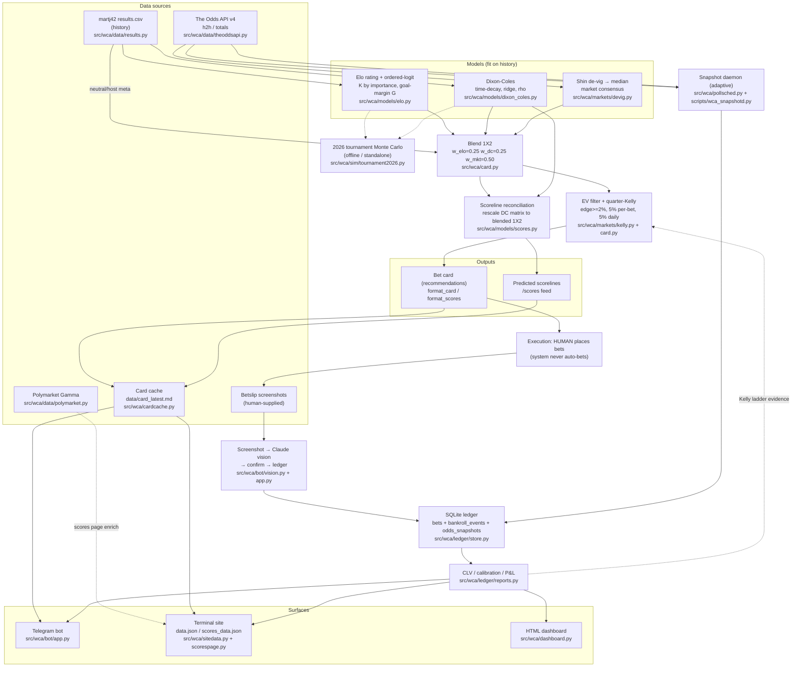
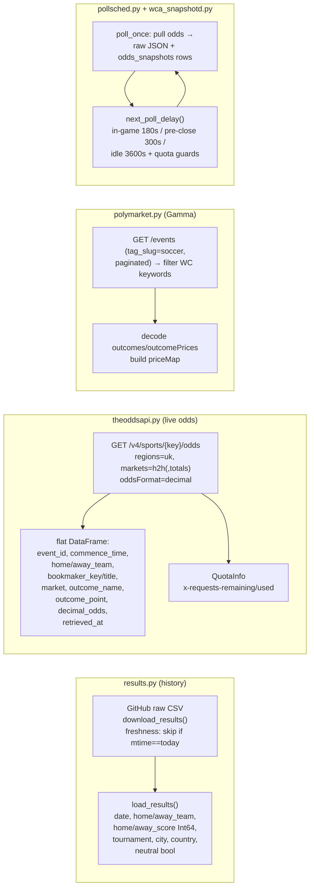
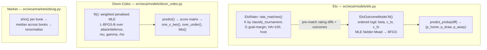
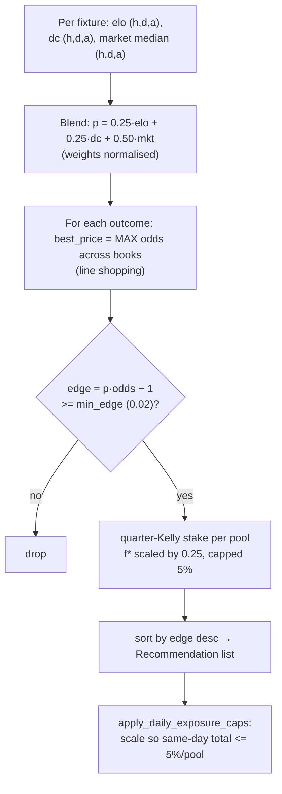
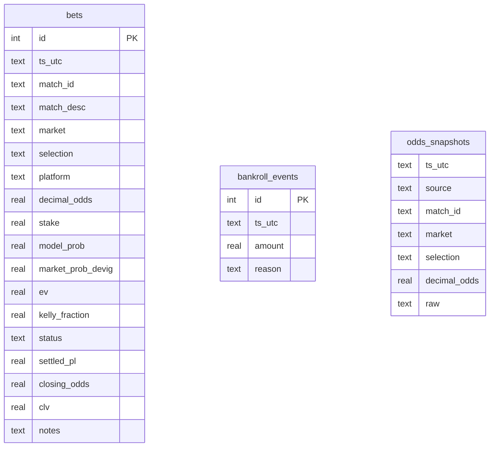
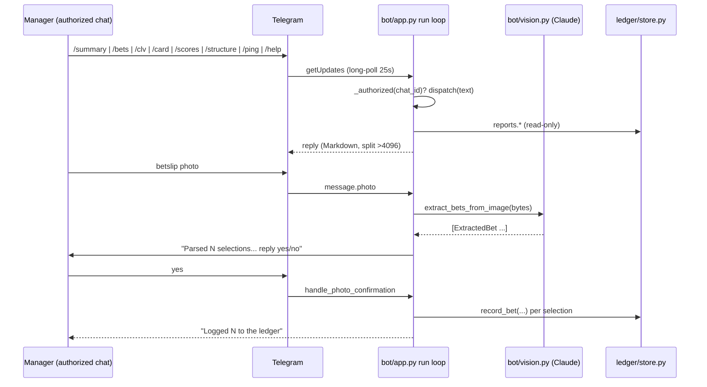
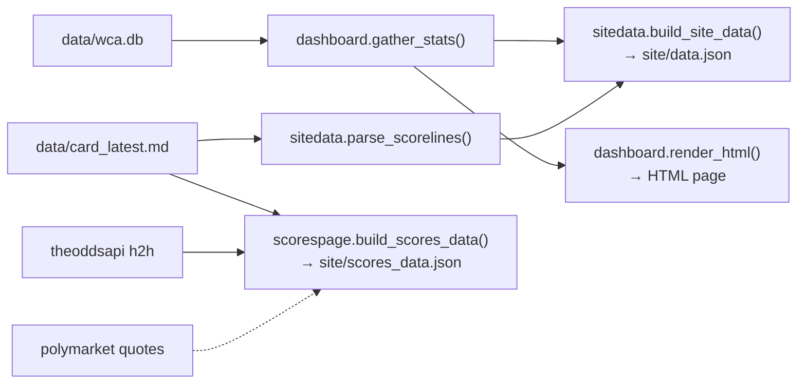

# World Cup Alpha — System Map

The deep, code-verified companion to the README's auto-generated structure flowchart.
Every claim below is annotated with the source file (relative path) it was read from.
Where the code disagrees with the README or `docs/ARCHITECTURE.md`, **the code is documented
and the discrepancy is flagged**.

> Scope: this is a description of how the system *actually works today*, verified module by
> module against `src/wca/**`, `scripts/**`. It is not aspirational. Planned upgrades are
> isolated in the [Improvement Map](#9-improvement-map).

---

## 1. Explain it in 60 seconds

> Recite this to anyone who asks "what does this thing do?"

We bet the 2026 World Cup as a disciplined quant. **Three feeds come in**: historical
international results (martj42 `results.csv`), live bookmaker odds (The Odds API, UK region),
and Polymarket prices. **Two models** are fitted on the history — an international **Elo**
rating with an ordered-logit win/draw/loss model, and a time-decayed **Dixon-Coles** Poisson
goals model. For each upcoming fixture we **de-vig** every book's 1X2 with the **Shin** method,
take the per-column **median** as a market consensus, then **blend** Elo + Dixon-Coles + market
into one (home, draw, away) probability — with the **market weighted 50%** because the market is
hard to beat (`src/wca/card.py`). We **line-shop**: take the *best* decimal price across books per
outcome, compute the edge `p·odds − 1`, and keep it only if the edge clears **2%**
(`src/wca/card.py`). Surviving picks get a **quarter-Kelly** stake, capped at **5% per bet** and
scaled down so same-day exposure stays under **5%** of the pool bankroll (`src/wca/markets/kelly.py`).
A reconciled **correct-score** view is published alongside, rescaled so its 1X2 exactly matches the
blended bet (`src/wca/models/scores.py`). **The system never places a bet** — it emits a card. A
human places it, screenshots the betslip, and the **Telegram bot** reads the slip via Claude vision,
shows what it parsed, and writes it to the **SQLite ledger** only after a `yes` (`src/wca/bot/`). A
background **snapshot daemon** captures odds on an adaptive cadence (fast in-game, faster pre-kickoff,
slow when idle) so we can record the **closing line**. The ledger then computes our north-star metric,
**CLV** (did we beat the close?), plus calibration (Brier vs the de-vigged market) and P&L. Everything
surfaces through the **bot**, a static **terminal site** (`data.json` / `scores_data.json`), and an
HTML **dashboard**.

**The one-line mental model:** `history + market → blend → edge filter → quarter-Kelly card → human places → ledger → CLV`.

---

## 2. Top-level pipeline

**Reading the diagram.** Solid arrows are wired in code today. Dashed arrows are wired but
either optional/best-effort (Polymarket → scores page), informational (models → simulator,
which is a standalone harness), or designed-but-not-yet-invoked from the card builder (the
CLV-gated Kelly ladder feeds back into staking via `KellyPolicy` but `build_card` does not call
it yet — see [§5](#5-decision-logic) and [§9](#9-improvement-map)).

---

## 3. Ingestion

Every external feed and its exact fields/cadence.

### 3.1 Historical results — `src/wca/data/results.py`
- **Source:** martj42 `results.csv` from the GitHub master branch
  (`_DEFAULT_URL`, `_DEFAULT_DEST = "data/raw/results.csv"`).
- **Fields parsed by `load_results`:** `date` (`datetime64`), `home_team`, `away_team`,
  `home_score`/`away_score` (nullable `Int64`), `tournament`, `city`, `country`,
  `neutral` (coerced from `"true"/"1"/"yes"` strings to `bool`).
- **Cadence:** `download_results` skips the network if the file already exists *and* its mtime is
  today (UTC), unless `force=True` — i.e. at most one refresh per day.
- **Helpers:** `filter_since(df, since)`; `add_outcome_column` → `"H"/"D"/"A"` (null on null score).
- **Consumed by:** Elo + Dixon-Coles fitting and the neutral/host lookup in `src/wca/card.py`.

### 3.2 Live odds — `src/wca/data/theoddsapi.py`
- **API:** The Odds API v4, `GET /v4/sports/{sport_key}/odds`. Sport key used everywhere is
  `soccer_fifa_world_cup` (`scripts/wca_build_card.py`, `scripts/wca_snapshotd.py`,
  `scripts/wca_scores_data.py`). Default `regions="uk"`, `markets="h2h,totals"` in the function
  default, but the card/daemon call it with `markets="h2h"` only.
- **Auth:** `ODDS_API_KEY` env var (`_get_api_key`). Plan: paid tier, **20,000 credits/month**.
- **Output:** flat one-row-per-outcome DataFrame with columns
  `event_id, commence_time, home_team, away_team, bookmaker_key, bookmaker_title, market,
  outcome_name, outcome_point, decimal_odds, retrieved_at`. `commence_time`/`retrieved_at` are
  parsed to UTC datetimes. Empty result returns an empty frame with the same columns.
- **Quota:** `QuotaInfo(remaining, used)` parsed from `x-requests-remaining` / `x-requests-used`
  response headers — this is what drives the budget guards in `pollsched`.
- **h2h outcome naming:** the two team names plus the literal `"Draw"` (see `_index_odds` in
  `src/wca/card.py`).

### 3.3 Polymarket — `src/wca/data/polymarket.py`
- **API:** Gamma read-only, `https://gamma-api.polymarket.com`. `search_events(query)`,
  `get_event(id)`, and `find_world_cup_markets()` (paginates `tag_slug="soccer"`, filters titles/
  descriptions for `"world cup" / "fifa world cup" / "wc 2026" / "2026 wc"`, de-dupes by id).
- **Price decoding:** `outcomes` and `outcomePrices` arrive as JSON-encoded strings (e.g.
  `'["Yes","No"]'`, `'["0.62","0.38"]'`); `_parse_market_prices` decodes them and builds a
  `priceMap` of outcome→float.
- **Consumed by:** the scores-page CLI (`scripts/wca_scores_data.py` → `_collect_pm_quotes`),
  best-effort, to add a `polymarket` venue column on the scores page. **Not** part of the bet card
  blend. (The bankroll pool is real, $1,310 actual USD; the *price feed* is enrichment only.)

### 3.4 Betslip screenshots — `src/wca/bot/vision.py`
- **Source:** a photo/screenshot the human sends the Telegram bot after placing a bet.
- **Extraction:** posted to the Anthropic Messages API (`API_URL`, `ANTHROPIC_VERSION="2023-06-01"`,
  default model `claude-sonnet-4-6` overridable via `ANTHROPIC_VISION_MODEL`, `MAX_TOKENS=1024`),
  built on `requests` only — no SDK, image base64-encoded inline.
- **Fields per selection (`ExtractedBet`):** `match_desc, market, selection, bookmaker,
  decimal_odds, stake, potential_returns, status, is_boost, confidence, raw_text, currency`.
  Fractional/EVS odds and prediction-market cents are converted to decimal odds
  (`fractional_to_decimal`, e.g. `31/20→2.55`, `EVS→2.0`, `69c→1.449`).
- **Cadence:** on demand, one slip at a time. The extractor *never* writes the ledger.

### 3.5 Card cache — `src/wca/cardcache.py`
- A file (`data/card_latest.md`) holding the most recent formatted card. Format: a one-line
  `<!-- generated: <ISO> -->` header followed by the raw card body.
- `write_card` / `read_card` are **clock-free** (the caller injects timestamps). `read_card`
  returns `{text, generated, stale}`; staleness needs both `now_utc` and `max_age_hours` and a
  parseable header timestamp. The bot treats a card older than `CARD_MAX_AGE_HOURS = 6.0` as
  ⚠️ STALE (`src/wca/bot/app.py`).

### 3.6 Snapshot daemon cadence — `src/wca/pollsched.py` + `scripts/wca_snapshotd.py`
`next_poll_delay(now_utc, kickoffs, quota_remaining, policy)` is **pure** (clock injected as a
string) and returns `(delay_seconds, reason)`. Defaults from `PollPolicy`:

| Tier | Trigger | Delay (default) | `reason` |
|---|---|---|---|
| **in-game** | any kickoff with `ko ≤ now < ko + match_duration` (`match_duration_minutes=130`) | `in_game_seconds = 180` | `in_game` |
| **pre-close** | any kickoff in the future within `_PRE_CLOSE_WINDOW_SECONDS = 600` (10 min) | `pre_close_seconds = 300` | `pre_close` |
| **idle** | nothing live or imminent | `idle_seconds = 3600` | `idle` |

Budget guards layered on top (only when `quota_remaining` is known):
- **Hard reserve:** `quota_remaining < min_reserve (60)` → return `low_quota_idle_seconds = 10800`
  (3 h), reason `quota-reserve`. **Stops everything, even the closing line.**
- **Low quota:** `quota_remaining < _LOW_QUOTA_THRESHOLD (200)` and the tier is *not* `pre_close`
  → throttle to `low_quota_idle_seconds` (reason `low_quota_idle`). Closing-line polls are
  exempt — they are the highest-value capture.
- Unparseable `now_utc` → falls back to `idle` so the daemon keeps ticking rather than busy-looping.

The daemon (`scripts/wca_snapshotd.py`) persists each pull **two ways**: a raw JSON file at
`data/raw/snapshots/oddsapi_h2h_uk_<UTCSTAMP>.json` (audit/replay) and flattened rows into the
`odds_snapshots` SQLite table via `snapshot_all` (`src/wca/data/snapshot.py`). It scrapes kickoff
times from the just-pulled frame and feeds them back into `next_poll_delay`. `--once` runs a single
iteration (for cron); SIGTERM/Ctrl-C exit cleanly.

> **Note (cadence numbers):** the task brief listed in-game 180s / pre-close within-10-min 300s /
> idle 3600s — these match the `PollPolicy` defaults exactly. The estimate helper
> `estimate_monthly_calls` is documentation-only.

---

## 4. Modeling

### 4.1 International Elo — `src/wca/models/elo.py`

**`EloRater`** (rating engine). Constructor defaults read from the code:
- `initial_rating = 1500.0`
- `home_advantage = 100.0` (added to the home side on non-neutral venues; granted to a
  tournament `host` even on a neutral venue)
- `host_advantage = True`
- **K-factors by tournament importance** (`DEFAULT_K_FACTORS`):

  | importance class | K |
  |---|---|
  | `friendly` | 20.0 |
  | `nations_league` | 30.0 |
  | `qualifier` | 40.0 |
  | `continental` | 50.0 |
  | `world_cup` | 60.0 |

  `classify_tournament` keyword-maps the martj42 `tournament` string case-insensitively;
  qualification is detected **before** the parent competition so "FIFA World Cup qualification"
  → `qualifier`, not `world_cup`. Unknown → `friendly` (`DEFAULT_IMPORTANCE`).
- **Goal-margin multiplier `G`** (`goal_margin_multiplier`): `|gd|∈{0,1}→1.0`, `2→1.5`, `3→1.75`,
  `≥4→1.75 + (|gd|−3)/8`.
- **Update:** `E = 1/(1 + 10^(−dr/400))`, `R' = R + K·G·(W − E)`; the winner's gain equals the
  loser's drop. `rate_matches(df)` processes chronologically (stable sort on `date`) and returns
  `{final_ratings, history}` with pre/post ratings per match.

**`EloOutcomeModel`** (ordered-logistic / proportional-odds, McCullagh 1980).
- Covariate `x = diff / scale`, `scale = 400.0` (default).
- Parameters: `beta`, two cut points `c_lo ≤ c_hi`. Pre-fit defaults `beta=1.0, c_lo=−0.5,
  c_hi=0.5`. Fit by MLE (`fit`): Nelder-Mead then a BFGS polish; the cut-point ordering is
  guaranteed via a softplus-parameterised gap.
- `predict_proba(diff)` returns **`(p_home, p_draw, p_away)`** (note: internal encoding is
  away/draw/home; the public API reorders to the 1X2 market convention).

**How the card uses it (`src/wca/card.py::fit_models`):** fits the rater on all played matches,
reconstructs each match's pre-game rating diff (adding `home_advantage` on non-neutral venues) and
the realised ordinal outcome, then fits the `EloOutcomeModel` on those `(diff, outcome)` pairs.

### 4.2 Time-decayed Dixon-Coles — `src/wca/models/dixon_coles.py`

Bivariate-Poisson-with-`tau`-correction goals model. Means:
`log λ_home = μ + attack_i − defence_j + γ·(not neutral)`, `log λ_away = μ + attack_j − defence_i`.

**Constructor defaults (read from code):**
- `xi = DEFAULT_XI = ln(2)/2 ≈ 0.34657` ⇒ **2-year half-life** (`DEFAULT_HALF_LIFE_YEARS = 2.0`).
  Pass `half_life_years` to derive `xi` instead; `xi=0` disables decay.
- `reg_lambda = 0.01` — ridge (L2) penalty on attack/defence.
- `min_matches = 5` — teams below this are "low-data".
- `low_data_reg_multiplier = 5.0` — extra ridge for low-data teams (essential for international
  minnows).
- `max_goals = 10` — score-matrix truncation.
- `rho` is a fitted dependence parameter (bounded `(−1, 1)`; D-C report it ≈ `(−0.2, 0.2)`),
  applied via `dc_tau` only to the four low scorelines `(0,0),(0,1),(1,0),(1,1)`.

**Decay weight:** `w = exp(−xi · days_ago / 365.25)`. **Fit:** penalised weighted MLE via
`L-BFGS-B`; attack/defence are re-centred mean-zero inside the objective for identifiability;
`fit_dataframe` derives `days_ago` from `date` vs a `reference_date` (default: latest date).

**Outputs** (`ScorelinePrediction`): `one_x_two()` (`p_home` = lower triangle, `p_draw` = trace,
`p_away` = upper triangle), `over_under(line=2.5)`, `both_teams_to_score()`,
`top_correct_scores(k)`, `expected_goals()`.

> **Discrepancy (important).** The card builder fits Dixon-Coles with **`half_life_years = 8.0`**
> (`src/wca/card.py::fit_models` default), which overrides the module's own 2-year default. So the
> *deployed* DC half-life is **8 years**, while the *library* default is **2 years**. Document the
> deployed value (8y) when reasoning about the live card; the 2y default applies only to a bare
> `DixonColesModel()`.

### 4.3 Market baseline (Shin de-vig) — `src/wca/markets/devig.py`

Three de-vig methods exist (`METHODS = multiplicative, power, shin`); **Shin is the one wired into
the pipeline**. `shin()` solves for the insider-trading proportion `z∈[0,1)` (Štrumbelj-2014
closed form) by bisection so fair probabilities sum to one; it removes more probability from
longshots than multiplicative (the favourite/longshot correction). `shin_z()` returns the fitted
`z` for diagnostics. All three are exact (identity) on a fair book.

**Consensus (`src/wca/card.py::market_consensus`):** for each book with a complete 1X2,
`shin()` the three prices; stack the fair rows; take the **per-column median** across books;
renormalise. Returns `None` if no book has a complete 1X2 (that fixture is then skipped).

---

## 5. Decision logic

All values below are read from `src/wca/card.py` and `src/wca/markets/kelly.py`.

- **Blend weights** (`BlendWeights`): `elo = 0.25`, `dc = 0.25`, `market = 0.50`, normalised to
  sum 1. The comment states these are **pre-backtest priors, deliberately market-anchored**, not
  yet fitted (calibration backtest deferred).
- **Market consensus method:** Shin per book → **median** across books → renormalise.
- **Line shopping:** `best_price` takes the **maximum** decimal odds available across books for
  each outcome, and records the book name.
- **Edge / EV gate:** `edge = p·odds − 1` (`kelly.edge`); keep only `edge ≥ min_edge`,
  **`min_edge = 0.02`** (2%). `ev_per_unit == edge`.
- **Quarter-Kelly stake** (`kelly.stake`): `f_full = (p·o − 1)/(o − 1)` (0 if non-positive edge),
  then `f = min(f_full · fraction, cap)`, stake `= f · bankroll`. Defaults
  **`fraction = 0.25` (quarter Kelly)**, **`cap = 0.05` (5% per bet)**.
- **Per-pool sizing** (`PoolConfig`): `kelly_fraction = 0.25`, `per_bet_cap = 0.05`,
  `daily_exposure_cap = 0.05`, default `currency = "GBP"`. The card builder
  (`scripts/wca_build_card.py`) constructs a single pool `name="main", bankroll=1000.0`.
- **Same-day exposure cap** (`apply_daily_exposure_caps` → `kelly.simultaneous_exposure_scale`):
  scale all of a pool's stakes by a common factor so their total ≤ `daily_exposure_cap · bankroll`
  (5%), preserving relative sizing; unchanged if already within budget.
- **Output:** ranked `Recommendation`s (by edge desc) carrying `model_prob, market_prob, elo_prob,
  dc_prob, edge, ev_per_unit, best_book, best_odds, stakes{pool→stake}`.

**The CLV-gated Kelly ladder (`KellyPolicy` in `src/wca/markets/kelly.py`)** — pre-registered
2026-06-11. Rungs: rung0 `c=0.25` (until 50 settled bets *with closing odds*), rung1 `c=0.35`
(≥50 settled **and** to-date CLV>0), rung2 `c=0.50` (≥100 settled **and** to-date CLV>0, the
tournament ceiling). One-rung demotion (floored at 0) when rolling-50 CLV<0. While on rung0,
recommendations above `max_odds_unvalidated = 10.0` are filtered out. Arbitrage bets are exempt
from Kelly sizing and the ladder. The evidence inputs come from
`reports.staking_stats` (`n_settled`, `clv_to_date`, `rolling50_clv`).

> **Discrepancy.** `KellyPolicy` is **defined and tested but not yet invoked by `build_card`** —
> the card uses a fixed `pool.kelly_fraction = 0.25` and does not apply the rung promotion, the
> `max_odds_unvalidated` longshot filter, or arbitrage exemption. Wiring the ladder into the card
> builder is a tracked upgrade ([§9](#9-improvement-map)).
>
> **Discrepancy.** The README/`ARCHITECTURE.md` describe the blend as "logistic or ensemble" and
> list live blend logic as "in progress". In code the blend is a **fixed convex combination**
> (0.25/0.25/0.50), fully wired. Document the convex blend.

### 5.1 Scoreline reconciliation — `src/wca/models/scores.py`
The published correct-score view must imply *exactly* the same 1X2 we bet. `reconcile_scoreline_matrix`
rescales each of the three regions of the DC score matrix (home-win `h>a`, draw `h=a`, away-win
`h<a`) by a single constant so region masses equal the blended `(p_home, p_draw, p_away)`, while
preserving the within-region shape (the min-KL / max-entropy reconciliation). Degenerate regions
(near-zero source mass but positive target) are refilled from an independent-Poisson prior built
from the matrix's own implied means, falling back to canonical `1-0 / 0-0 / 0-1`. `scoreline_card`
then derives top-`k` scorelines (default 6), over/under (lines `1.5/2.5/3.5`), BTTS and the implied
1X2; `min_price(p)` is the minimum back price clearing `min_edge` (default 0.02). `build_score_cards`
in `src/wca/card.py` reuses the **same** blended 1X2 as `build_card`, so the scoreline prices can
never contradict the headline picks.

---

## 6. Bankroll & ledger

**Store — `src/wca/ledger/store.py`** (default DB `data/wca.db`, WAL mode, FK on):
- `record_bet(...)` inserts an `open` bet. `settle_bet(id, "won"/"lost")` → `settled_pl =
  (odds−1)·stake` on a win, `−stake` on a loss; only `open` bets can be settled.
  `void_bet` → `status='void', settled_pl=0`.
- `set_closing_odds(id, closing_odds)` computes **CLV** and stores it:
  **`CLV% = (decimal_odds_taken / closing_odds) − 1`** (return-ratio form; positive = beat the
  close). Requires `closing_odds > 1.0`.
- `add_bankroll_event(ts, amount, reason)` — deposit (+) / withdrawal (−). The **pool a deposit
  belongs to is tagged in `reason`** as `pool=<venue>` (e.g. `pool=polymarket`), parsed by the
  bot's `_pool_rows` (`src/wca/bot/app.py`).

**Pools (operating facts, surfaced via the bot's per-venue rollup):**
- **sportsbook** — £1,000 notional (scales to £2.5k at ~20 settled bets if avg CLV≥0, £5k at ~50;
  kill rule: real money pauses if CLV negative after ~50 bets).
- **polymarket** — $1,310 actual USD.
- **kalshi** — planned.

Venue mapping (`src/wca/dashboard.py::venue_for_platform`, mirrored in `bot/app.py::_venue_of`):
`polymarket→polymarket`, `kalshi→kalshi`, **everything else → sportsbook**.

**Free / promo bets:** the bot's `/bets` view treats a bet whose `notes` contains `"free"` as
risking no cash — it counts toward *max win* but contributes **zero to max loss**
(`src/wca/bot/app.py::handle_bets`). (Free/promo bets are excluded from max-loss exposure.)

**Reports — `src/wca/ledger/reports.py`** (all stateless, `db_path` in):
- `clv_report` → `per_bet` table + `avg_clv`, `pct_beat_close`, `n_bets` over bets with a recorded
  `closing_odds`.
- `calibration_report(n_bins=5)` → equal-width `model_prob` bins with observed win rate, plus two
  Brier scores over the settled sample: `brier_model = mean((model_prob − outcome)²)` and
  `brier_market = mean((market_prob_devig − outcome)²)`. `BS_model < BS_market` ⇒ the model beats
  the bookmaker's own de-vigged forecast.
- `staking_stats` → `n_settled` (settled **and** has CLV), `clv_to_date`, `rolling50_clv` — the
  exact inputs `KellyPolicy.evaluate` consumes.
- `bankroll_curve`, `open_exposure`, `summary` (P&L, ROI = `total_pl/total_staked` over settled,
  current bankroll = deposits + settled P&L).

**KPI hierarchy:** (1) **CLV** — primary; (2) **calibration** (Brier vs de-vigged market);
(3) **bankroll** (lagging, noisy at this sample size).

---

## 7. Telegram bot

**Commands (`dispatch` in `src/wca/bot/app.py`):** `/start`,`/help` (`HELP_TEXT`), `/summary`
(portfolio P&L/ROI/CLV + per-pool bankroll), `/bets` (open bets, max win/max loss by venue, free-bet
aware), `/clv`, `/card` (reads the **cached** card; flags ⚠️ STALE past 6 h), `/scores` (parses the
cached card's scorelines section via `wca.sitedata.parse_scorelines`), `/structure` (latest
`docs/architecture/structure_*.md` metrics table), `/ping`→`pong`. Unknown → help hint.

**Auth:** only the configured `TELEGRAM_CHAT_ID` may drive the bot; any other chat gets a one-line
"Unauthorized. This chat id is `<id>`" (so the operator can learn their id) and **no data**.

**Photo → vision → confirm → ledger flow:**
1. Largest photo downloaded (`telegram.download_photo`).
2. `handle_photo` → `extract_bets_from_image` → parks the parsed `ExtractedBet`s in an in-process
   `_PENDING_PHOTO_BETS[chat_id]` and replies with a human-readable summary (boost ⚡ and low-conf
   ⚠️ flags shown), asking for `yes`/`no`.
3. A lone `yes`/`y` → `record_bet` per selection (`match_id = "MANUAL_" + slug`, note records
   currency/confidence/boost). `no`/`n` discards. The pending slip is in-memory only and expires
   on restart, so an unconfirmed misread never reaches the ledger.

**Pushed-bet confirmation:** `Y BET-<id>` / `N BET-<id>` is recognised by `handle_confirmation`
but the ledger write is *pending card-generator wiring* (returns an acknowledgement only).

**Transport — `src/wca/bot/telegram.py`:** minimal `requests`-based client; long-poll
`getUpdates`; `sendMessage` auto-splits at 4096 chars; token from `TELEGRAM_BOT_TOKEN`.

> **Discrepancy.** The `app.py` module docstring lists 6 commands and omits `/bets` and `/scores`;
> the live `dispatch` actually handles **8** (`/start` `/help` `/summary` `/bets` `/clv` `/card`
> `/scores` `/structure` `/ping`). The README structure block reports "Bot commands: 6". Document
> the **8** wired in `dispatch`.

---

## 8. Website & dashboard

Three outputs, all built by **clock-free** functions (the CLI stamps `now_utc`):

- **`site/data.json`** — `src/wca/sitedata.py::build_site_data` (CLI `scripts/wca_site.py`).
  Reuses `dashboard.gather_stats` for venue rollups/totals/CLV/positions, and parses the cached
  card's scorelines into `predictions`. Sections: `meta, totals, totals_by_currency,
  venues{sportsbook/polymarket/kalshi}, clv, positions, predictions`. Each `venues` block and each
  `positions` entry also carries a `currency` tag (`VENUE_CURRENCY`: sportsbook→GBP,
  polymarket/kalshi→USD); `totals_by_currency` rolls the venue blocks up *per currency* because
  GBP and USD are never summed into one number (the legacy single-number `totals` block is kept for
  back-compat). **Updates when** the ledger or the cached card change and the CLI is re-run.
- **`site/scores_data.json`** — `src/wca/scorespage.py::build_scores_data`
  (CLI `scripts/wca_scores_data.py`). Per fixture: predicted scoreline ladder (from the card),
  over/under + BTTS, an **approximate** model 1X2 reconstructed from the *top-k* scores
  (`approx_1x2: True`), and a `venues` list of per-bookmaker h2h prices + implied probs +
  edge-vs-model, plus an optional `polymarket` venue from `pm_quotes`. Team names canonicalised on
  both sides before matching. **Updates when** the card/odds/PM quotes change and the CLI runs.
- **HTML dashboard** — `src/wca/dashboard.py::render_html` (CLI `scripts/wca_dashboard.py`). A
  fully self-contained page (inlined CSS, inline-SVG wagered-by-venue bar chart, open-bets table,
  CLV/P&L tiles). No external assets, every DB string HTML-escaped. **Updates when** re-rendered
  from the ledger.

---

## DATAPOINT TABLE

Every datapoint → origin → consumers → outputs it influences. Paths are relative.

| Datapoint | Originates in | Consumed by | Influences (output) |
|---|---|---|---|
| `date` | `data/results.py` (CSV) | Elo `rate_matches` chronological order; DC `days_ago`/decay weight | Elo ratings, DC λ's → blend |
| `home_team` / `away_team` (history) | `data/results.py` | Elo, DC team keys; neutral/host lookup `card.py` | every model prob |
| `home_score` / `away_score` | `data/results.py` | Elo `W`+`G`; DC goal counts; outcome label | ratings, DC params, Elo logit fit |
| `tournament` | `data/results.py` | Elo `classify_tournament` → K-factor | rating update magnitude |
| `neutral` | `data/results.py` (and odds meta) | Elo home-adv, DC `γ`, card `_meta_lookup` | λ's, rating diff → all probs |
| `country` / host | `data/results.py` | `card.py` host detection (`host_nations`) | host advantage in Elo diff |
| `city` | `data/results.py` | (loaded, not modelled) | — |
| `event_id` | `data/theoddsapi.py` | `card._index_odds`, snapshot `match_id` | `Recommendation.match_id`, snapshots |
| `commence_time` | `data/theoddsapi.py` | card fixture filter; `pollsched` kickoffs; scores-page kickoff | which fixtures carded; poll cadence |
| `home_team`/`away_team` (feed) | `data/theoddsapi.py` | `teamnames.canonical` → model lookup | correct model prob (mis-resolve = garbage edge) |
| `bookmaker_key` / `bookmaker_title` | `data/theoddsapi.py` | `best_price`, `market_consensus`, scores-page venues | `best_book`, consensus, venue rows |
| `market` (`h2h`/`totals`) | `data/theoddsapi.py` | `_index_odds` (filters `h2h`); snapshot daemon | which prices enter the blend |
| `outcome_name` | `data/theoddsapi.py` | mapped to home/draw/away (`_index_odds`, `_leg_for_outcome`) | per-outcome odds |
| `outcome_point` | `data/theoddsapi.py` | (totals line; not used by h2h card) | totals markets (future) |
| `decimal_odds` (book) | `data/theoddsapi.py` | `devig.shin`, `best_price`, `edge`, snapshots | market prob, edge, stake, CLV closing |
| `retrieved_at` | `data/theoddsapi.py` | provenance | — |
| `x-requests-remaining` (quota) | `data/theoddsapi.py` headers | `pollsched.next_poll_delay` budget guards | poll cadence / reserve stop |
| `outcomes`/`outcomePrices`/`priceMap` | `data/polymarket.py` | scores-page `pm_quotes` | `polymarket` venue column, edge-vs-model |
| Elo `rating` (per team) | `models/elo.py` | `_rating_diff` → outcome logit | `elo_prob` (h/d/a) → blend |
| Elo `home_advantage=100`, K-factors, `G` | `models/elo.py` | rating updates | ratings |
| `beta`,`c_lo`,`c_hi` (logit) | `models/elo.py` fit | `predict_proba` | `elo_prob` |
| DC `attack`/`defence`/`mu`/`gamma`/`rho` | `models/dixon_coles.py` fit | `expected_lambdas`, `score_matrix` | `dc_prob`, scorelines |
| DC `xi` / half-life (**8y deployed**) | `card.py::fit_models` | decay weights | DC params recency |
| `reg_lambda`,`min_matches`,`low_data_mult` | `models/dixon_coles.py` | penalised MLE | DC shrinkage |
| Shin fair probs / `z` | `markets/devig.py` | `market_consensus` median | `market_prob` → blend |
| blended `(p_home,p_draw,p_away)` | `card.py::_iter_fixture_blends` | edge/Kelly; scoreline reconcile | picks, stakes, scoreline prices |
| `best_odds` / `best_book` | `card.py::best_price` | `edge`, `stake`, card display | recommendation, EV |
| `edge` / `ev_per_unit` | `markets/kelly.py::edge` | `min_edge` gate, sort | which picks survive, ranking |
| `min_edge=0.02` | `card.py` / `models/scores.py` | gate + min back price | inclusion, score `back >=` |
| Kelly `fraction=0.25`,`cap=0.05` | `markets/kelly.py`,`PoolConfig` | `stake` | stake size |
| `daily_exposure_cap=0.05` | `PoolConfig` | `simultaneous_exposure_scale` | same-day stake scaling |
| `bankroll` (per pool) | `scripts/wca_build_card.py` / `PoolConfig` | `stake` | stake currency amount |
| `KellyPolicy` rungs / `max_odds_unvalidated=10` | `markets/kelly.py` | `evaluate` (not yet in card) | *would* set fraction + longshot filter |
| `stake` (bet) | ledger `record_bet` / vision | settle P&L, exposure, dashboards | P&L, max loss, wagered |
| `model_prob` | `Recommendation`→ledger | `calibration_report` Brier | model Brier, calibration bins |
| `market_prob_devig` | `Recommendation`→ledger | `calibration_report` | market Brier (baseline) |
| `decimal_odds` (taken) | ledger `record_bet` | `settle_bet` P&L; CLV numerator | settled P&L, CLV |
| `closing_odds` | ledger `set_closing_odds` (from snapshots) | CLV formula | `clv`, ladder eligibility |
| `clv` | ledger `set_closing_odds` | `clv_report`, `staking_stats` | primary KPI, Kelly ladder |
| `status` | ledger lifecycle | reports, dashboard, `/bets` | P&L vs open exposure |
| `settled_pl` | `settle_bet` | `bankroll_curve`, `summary` | P&L, ROI, bankroll |
| `notes` (`free`, `pool=`, ingest) | vision/CLI/bot | `_pool_rows`, `handle_bets` free-bet | per-pool bankroll, max-loss exclusion |
| `bankroll_events.amount`/`reason` | ledger `add_bankroll_event` | `_pool_rows`, `summary` | per-pool deposits, current bankroll |
| `odds_snapshots` rows (`ts_utc`,`decimal_odds`,`raw`) | `data/snapshot.py` daemon | CLV replay / closing-line source | `closing_odds` → CLV |
| `is_boost` / `confidence` / `currency` | `bot/vision.py` | confirmation prompt, note | ingest correctness, free/boost handling |
| ExtractedBet `decimal_odds`/`stake` | `bot/vision.py` | `record_bet` | ledger bet row |
| card `generated` timestamp / `stale` | `cardcache.py` | bot `/card`, site builders | staleness flag on surfaces |
| sim `prob_fn`, `et_skill_weight=0.5`, `mean_goals=2.7` | `sim/tournament2026.py` | Monte Carlo | reach/win probabilities (offline) |

---

## 9. Improvement Map

Per stage: planned/possible upgrades and what each would change. Items marked **(gap)** are
already designed in code but not yet wired.

### Ingestion
- **Kalshi client** — add `src/wca/data/kalshi.py` mirroring the Polymarket reader; lights up the
  third (planned) bankroll pool already plumbed through the venue rollups (`dashboard.VENUES`).
- **Betfair API** — exchange prices as a CLV reference (sharper closing line than soft books) and
  eventually an execution venue; `BETFAIR_*` keys already templated in the README/`.env.example`.
- **Totals/correct-score market ingestion** — `theoddsapi.get_odds` already defaults to
  `markets="h2h,totals"` and parses `outcome_point`, but the card pulls `h2h` only; ingesting
  `totals` (and correct-score books) would feed the over/under and scoreline pages real prices.

### Modeling
- **Player-level ratings → lineup-aware DC inputs** — adjust per-fixture `attack`/`defence`
  (`expected_lambdas`) for confirmed XI / key absences; the biggest single accuracy lever for
  international football, where squad strength swings hugely between fixtures.
- **Weather / altitude covariates** — add fixture covariates to the DC log-mean (Mexico City
  altitude, heat in US summer venues) — relevant for a 2026 tournament spanning three countries.
- **Fit the blend weights** — replace the fixed `0.25/0.25/0.50` prior with weights fitted on the
  calibration backtest (the comment in `card.py` flags them as unfitted priors).
- **Backtest harness for `xi`/`reg_lambda`** — pick the DC half-life (currently a hand-set **8y**)
  and ridge by out-of-sample log-loss rather than by hand.

### Decision logic
- **Wire `KellyPolicy` into `build_card`** **(gap)** — currently `build_card` uses a flat
  quarter-Kelly and ignores the pre-registered ladder. Wiring it would (a) promote the fraction to
  0.35/0.50 only on demonstrated CLV, (b) filter longshots > `max_odds_unvalidated=10` while on
  rung0, (c) demote on negative rolling-50 CLV, (d) exempt arbitrage bets. Inputs already exist via
  `reports.staking_stats`.
- **Promo / boost EV models** — model 2-Up early-payout and super-sub style offers; needs
  goal-timing and substitution distributions (not just full-time scorelines). The ledger already
  carries `is_boost` and free-bet handling, so the data side is ready.
- **Arbitrage / middling detection** across the line-shopped book set (the best-price scan already
  surfaces cross-book dispersion).

### Bankroll & ledger
- **Auto-populate `closing_odds`** from the `odds_snapshots` table (pick the last pre-kickoff price
  per selection) instead of manual `set_closing_odds` — closes the CLV loop without human entry.
- **Pushed-bet ledger write** — finish `handle_confirmation` (`Y BET-<id>`) so a carded pick can be
  confirmed straight into the ledger (currently acknowledgement-only).

### In-play / surfaces
- **In-play models fed by the 3-min in-game snapshots** — the daemon already polls every
  `in_game_seconds=180` while a match is live; an in-play model could consume that stream for live
  1X2 / next-goal markets.
- **Correct-score market prices into the scores page** — replace the *approximate* top-k model 1X2
  (`approx_1x2: True` in `scorespage.py`) with real correct-score book prices once that market is
  ingested, and show true edge per scoreline.
- **Tournament simulator integration** — `sim/tournament2026.py` is a standalone Monte Carlo
  (group tie-breaks, official thirds-allocation table, ET/penalty model). Feeding it an
  Elo/DC-backed `prob_fn` would price outright/group/advancement markets and surface them on the
  site.

---

## Appendix: file-to-stage index

| Stage | Modules |
|---|---|
| Ingestion | `src/wca/data/{results,theoddsapi,polymarket,snapshot,teamnames}.py`, `src/wca/pollsched.py`, `src/wca/cardcache.py`, `scripts/wca_snapshotd.py` |
| Modeling | `src/wca/models/{elo,dixon_coles,scores}.py`, `src/wca/markets/devig.py` |
| Decision | `src/wca/card.py`, `src/wca/markets/kelly.py`, `scripts/wca_build_card.py` |
| Ledger | `src/wca/ledger/{store,reports}.py`, `scripts/wca_cli.py` |
| Bot | `src/wca/bot/{app,telegram,vision}.py`, `scripts/wca_bot.py` |
| Website | `src/wca/{sitedata,scorespage,dashboard}.py`, `scripts/{wca_site,wca_scores_data,wca_dashboard,serve_site}.py` |
| Simulation | `src/wca/sim/tournament2026.py` |
| Structure analytics | `scripts/wca_structure.py`, `docs/architecture/structure_*.md` |

_See also: `README.md` (auto-generated structure flowchart + mission/KPIs), `docs/ARCHITECTURE.md`
(component map & design decisions), `docs/research/` and `docs/recon/` (methodology and market notes)._
