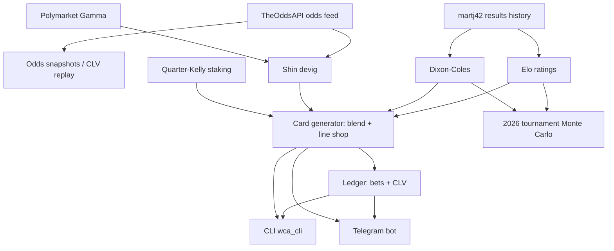

# Project Structure — 2026-06-11

Auto-generated by `scripts/wca_structure.py`. Do not edit by hand.

## Pipeline

## Metrics

| Metric | Value |
| --- | --- |
| Modules (src + scripts, excl. __init__) | 42 |
| Code lines (LOC, total) | 19569 |
| LOC: wca (top-level) | 3268 |
| LOC: wca.data | 1405 |
| LOC: wca.models | 1404 |
| LOC: wca.markets | 518 |
| LOC: wca.ledger | 677 |
| LOC: wca.bot | 1302 |
| LOC: wca.sim | 1253 |
| LOC: scripts | 2213 |
| LOC: tests | 6882 |
| Tests (def test_) | 540 |
| Data sources | 3 |
| Model classes | 5 |
| Bot commands | 9 |

**Complexity index: 102.0** (modules + tests/10 + data sources × 2)
