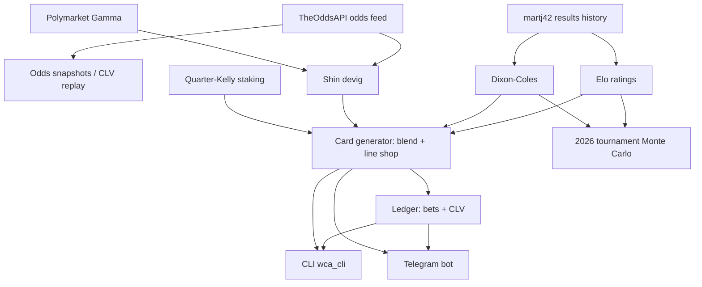

# Project Structure — 2026-06-18

Auto-generated by `scripts/wca_structure.py`. Do not edit by hand.

## Pipeline

## Metrics

| Metric | Value |
| --- | --- |
| Modules (src + scripts, excl. __init__) | 90 |
| Code lines (LOC, total) | 39715 |
| LOC: wca (top-level) | 8966 |
| LOC: wca.data | 1623 |
| LOC: wca.models | 2157 |
| LOC: wca.markets | 518 |
| LOC: wca.ledger | 723 |
| LOC: wca.bot | 2224 |
| LOC: wca.sim | 1253 |
| LOC: scripts | 7262 |
| LOC: tests | 12653 |
| Tests (def test_) | 973 |
| Data sources | 3 |
| Model classes | 14 |
| Bot commands | 13 |
