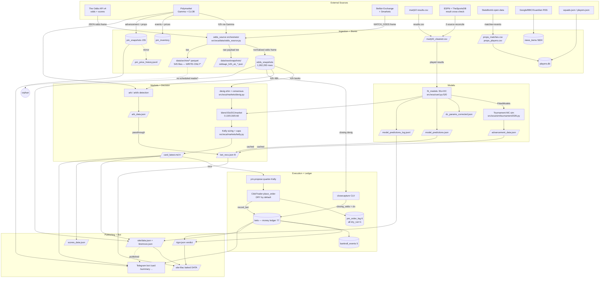

# World Cup Alpha — Data Usage & Lineage Report

**Scope:** End-to-end data lineage for the entire `World Cup Alpha` pipeline — external sources → ingestion/stores → models → markets/decision → execution/ledger → publishing/bot. Every lineage edge, assumption, and storage status below is cited to `file:line` and was verified by reading the code and querying `data/wca.db` (read-only) on **2026-06-30**.

**Verification note (READ THIS):** The per-stage source maps cite many modules by bare filename (e.g. `card.py`, `dixon_coles.py`, `elo.py`, `kelly.py`, `devig.py`). The verified on-disk paths are:

| Cited as | Actual path |
|---|---|
| `card.py` | `src/wca/card.py` |
| `dixon_coles.py`, `elo.py`, `scores.py`, `structural.py`, `scorers.py`, `betbuilder.py`, `props.py` | `src/wca/models/*.py` |
| `kelly.py`, `devig.py` | `src/wca/markets/*.py` |
| `tournament2026.py` | `src/wca/sim/tournament2026.py` |
| `advancement.py`, `pmhistory.py`, `outrightedge.py`, `arb.py`, `arbfx.py`, `matched.py`, `clvbench.py`, `venuesbench.py`, `linemove.py`, `sitedata.py`, `sync.py`, `scorespage.py`, `dashboard.py` | `src/wca/*.py` |

Line numbers in the source maps were spot-checked and hold within ±a few lines. Where I found a **material discrepancy** versus the input maps, it is flagged **[CORRECTION]** inline. Where I could not confirm a reader/writer, it is flagged **UNVERIFIED** (preserving the input labels).

---

## 1) OVERVIEW + FULL DATA FLOW

World Cup Alpha is a real-money football-betting research and execution system for the 2026 FIFA World Cup. It ingests live odds (The Odds API, Polymarket, Betfair, Smarkets), historical results (martj42 + ESPN/TheSportsDB cross-check), and StatsBomb event data; fits **Elo + Dixon-Coles** match models and a **Monte-Carlo tournament simulator**; converts model probabilities into market decisions via **de-vigging, EV, and Kelly sizing**; (optionally) executes on **Polymarket CLOB** and books every wager into the **`bets` ledger** in `data/wca.db`; then publishes to a static site, an analytics site, and a Telegram bot.

**Two parallel decision surfaces exist and DISAGREE on constants** (verified):
- **(A) Live card pipeline** — `src/wca/card.py` `build_card→rank_card→format_ranked_card`, driven by `scripts/wca_build_card.py`, writes `data/card_latest.md`. Dual-pool **half-Kelly** (GBP £1,500 + PM $1,995, fraction **0.50**; `src/wca/card.py:161,162,172`).
- **(B) Cached Action-Desk feed** — `scripts/wca_betrecs.py`, writes `site/bet_recs.json`. Re-implements its own **flat quarter-Kelly** (GBP £2,000, PM $1,310, fraction **0.25**; `scripts/wca_betrecs.py:51-52`). **Not wired to (A)** — it reads cached JSON, not `build_card` output.

\* **[CORRECTION]** The storage map states the archive parquet lake has "ZERO `pd.read_parquet`/`pq.read` in src or scripts." Verified false: `scripts/wca_pm_backfill_archive.py:106` (`pq.ParquetFile(f).read().to_pylist()[0]`, reads `payload_json`) **does** read archive parquet. It is, however, **not in any CI/conductor schedule** (no hit in `.github/`, `deploy/`, `wca_conductor.py`, `build_analytics.sh`). So the lake is *write-only on the scheduled path*, with one **manual/unscheduled** reader. See §5.

---

## 2) STAGE-BY-STAGE

### Stage 1 — INGESTION (external data in)

#### Inputs
| Source | Format | Store | Cadence | file:line |
|---|---|---|---|---|
| The Odds API v4 odds (h2h/totals/btts/props) | JSON → 12-col DataFrame | `odds_snapshots` + `data/raw/snapshots/oddsapi_*.json` | hourly cron `0 * * * *` + mini snapshotd | `src/wca/data/theoddsapi.py:96-171,174-210` |
| The Odds API scores (live/completed) | JSON → normalised dicts | returned to caller (not written here) | on-demand | `src/wca/data/theoddsapi.py:213-267` |
| Polymarket Gamma events/markets | JSON (JSON-encoded strings decoded in place) | `pm_inventory`, h2h frame, `pm_snapshots` | card/accas build; `pm-snapshot --full` | `src/wca/data/polymarket.py:30-41,448-508` |
| Polymarket share-prices → h2h odds | flat odds frame `bookmaker_key='polymarket'`, `decimal_odds=round(1/price,4)` | in-memory → odds_source | card build | `src/wca/data/polymarket_odds.py:177-203,111-174` |
| Polymarket CLOB prices-history + book | JSON history `[{t,p}]` → `[(dt, price∈[0,1])]`; book → mid/spread | returned to caller (trends/movers/cashout) | on-demand | `src/wca/data/pm_clob_history.py:85-124,38-74` |
| martj42 international results CSV | CSV → typed DataFrame | `data/raw/results.csv` | daily freshness (`5 7,13,19 * * *`) + hourly force | `src/wca/data/results.py:31-76,79-128` |
| ESPN scoreboard JSON (cross-check) | JSON → FixtureResult; 8 leagues, no key | in-memory; reconcile only | per clean-results | `src/wca/data/fixture_sources.py:82-120,40-49` |
| TheSportsDB eventsday JSON (cross-check) | JSON → FixtureResult; public key `'3'` | in-memory; reconcile only | per clean-results | `src/wca/data/fixture_sources.py:127-162` |
| StatsBomb open-data (matches+events) | JSON, disk-cached | `data/raw/statsbomb/`, `data/processed/props_*.csv` | players.db build (cache warm ⇒ no net) | `src/wca/data/statsbomb.py:93-128,387-428` |
| Betfair Exchange live MATCH_ODDS | JSON-RPC → flat frame, best-back only | in-memory; session token `data/.betfair_session.json` (0600) | first odds source; OFF unless creds | `src/wca/data/betfair_exchange.py:374-439,314-371` |
| Betfair via The Odds API (adapter) | odds frame + `currency='GBP'` | in-memory; arb pipeline | on-demand | `src/wca/data/betfair.py:32-64` |
| Smarkets prices + positions | native v3 or Odds-API feed; back-only | in-memory; positions feed reconcile | on-demand; positions 60min | `src/wca/data/smarkets.py:310-341,139-176`; **positions shape INFERRED** `:148-149,185-192` |
| News: Google/BBC/Guardian/ESPN RSS | RSS/Atom XML → NewsItem; 8MB cap | `news_items` | newsd `--interval 600`, `--max-per-cycle 2` | `src/wca/news.py:1-33,294-305`; `scripts/wca_newsd.py:236-404` |
| Published squads + analyst overrides | JSON `{team:[names]}` / `{team:[{...}]}` | read into players.db `squad_members` | players.db build | `src/wca/data/players_db.py:114-136,340-364` |

#### Transforms
| Reads → Computes → Writes | file:line |
|---|---|
| Odds API events → one row/outcome; UTC coerce; tee raw → archive | `src/wca/data/theoddsapi.py:270-301,147-148` |
| odds_source orchestration: first-non-empty (or union/gapfill); scrub apiKey; tee odds frame | `src/wca/data/odds_source.py:80-159` |
| Snapshot odds → `odds_snapshots` + raw JSON; fold `outcome_point` into selection | `scripts/wca_snapshot_odds.py:63-91`; `src/wca/data/snapshot.py:174-235,124-171` |
| Polymarket → h2h frame: YES mid via `_yes_token_and_price`; `decimal=round(1/prob,4)` | `src/wca/data/polymarket_odds.py:91-174`; `src/wca/data/polymarket.py:155-212` |
| pm_inventory refresh: match events→fixtures; UPSERT; budget 20 | `src/wca/data/pm_inventory.py:207-335,146-204` |
| PM price-history append: advancement + WC markets → `pm_price_history.jsonl` + `pm_snapshots` | `scripts/wca_pm_snapshot.py:155-213`; `src/wca/pmhistory.py:55-84,152-175` |
| Results clean overlay: apply corrections (idempotent, validated) → `martj42_cleaned.csv` + `audit.json` | `src/wca/data/cleaning.py:122-230`; `scripts/wca_clean_results.py:103-118` |
| Results reconcile (2-source): auto-stage only when ESPN+TSDB agree; else review | `src/wca/data/reconcile.py:54-140`; `scripts/wca_clean_results.py:82-101` |
| StatsBomb → prop datasets (2nd-yellow=red; npxg excl pens) → `props_*.csv` | `src/wca/data/statsbomb.py:173-237,287-384` |
| Build players.db: team_rates pooled; per-90 (NULL if no min); thin<180; atomic `.tmp` | `src/wca/data/players_db.py:240-396` |
| News scan/score/insert/push: teams_of_interest → RSS → `news_items` + Telegram | `scripts/wca_newsd.py:236-404`; `src/wca/news.py:753-810` |
| Archive TEE: canonical JSON + sha256 dedup; hive parquet `date=/venue=/market=` | `src/wca/archive/tee.py:58-89`; `src/wca/archive/store.py:134-310` |

#### Outputs
| Output | Consumer | file:line |
|---|---|---|
| `odds_snapshots` table | linemove + CLV; `scripts/microstructure/*` | `src/wca/data/snapshot.py:26-51`; readers `src/wca/linemove.py:446` |
| `data/raw/snapshots/oddsapi_h2h_uk_*.json` | linemove `robust_event_meta` → newsd teams | `scripts/wca_snapshot_odds.py:82-87`; `src/wca/linemove.py:537-574` |
| normalized odds frame | `src/wca/card.py` best_price/build, betfair, arb | `src/wca/data/odds_source.py:127-159` |
| `pm_inventory` table | `src/wca/accas.py`; `scripts/microstructure/polymarket.py` | `src/wca/data/pm_inventory.py:46-63` |
| `pm_price_history.jsonl` | `outrightedge.convergence`; `wca_outright_edge_data.py`; intel | `src/wca/pmhistory.py:152-203` |
| `pm_snapshots` table | `convergence_inputs`→outrightedge; bot `/movers` | `src/wca/pmhistory.py:29-47,136-144` |
| `data/raw/results.csv` | cleaning input; reconcile raw_df | `src/wca/data/results.py:22,31-76` |
| `data/raw/martj42_cleaned.csv` | every model consumer via `resolve_results_path` | `src/wca/data/cleaning.py:45,233-244` |
| `props_matches.csv`, `props_players.csv` | `players_db.build_players_db` | `src/wca/data/statsbomb.py:426-427` |
| `data/players.db` | `src/wca/models/betbuilder.py`; `scripts/wca_betbuilder.py` | `src/wca/data/players_db.py:55,389` |
| `news_items` table | newsd dedupe/push | `src/wca/news.py:294-305` |
| `data/archive/*` parquet + `_manifest.jsonl` | `src/wca/bench/sources.py`; **also** manual `wca_pm_backfill_archive.py:106` **[CORRECTION]** | `src/wca/archive/store.py:134-199` |
| Betfair/Smarkets normalized positions | positions_sync reconcile (shadow); ledger | `src/wca/data/betfair_exchange.py:574-614` |

---

### Stage 2 — MODELS (forecasting)

#### Inputs
| Source | Format | Store | Cadence | file:line |
|---|---|---|---|---|
| Cleaned martj42 results | CSV (date/home/away/scores/tournament/neutral) | `data/raw/martj42_cleaned.csv` | card/advancement build; advancement re-runs if cache >12h | `src/wca/card.py:553,588,610`; `src/wca/models/dixon_coles.py:636` |
| Played 2026 WC group results | `List[Result]` (filtered tournament=='FIFA World Cup' & 2026 & same group) | in-memory | per `run_advancement` | `src/wca/advancement.py:325,352-374` |
| Live 1X2 odds frame (optional anchor) | odds DataFrame | upstream (passed in) | market fixtures only | `src/wca/advancement.py:259,285,311` |
| `data/structural/country_factors.csv` | CSV (team/conf/pop/gdp/culture/altitude) | present (2420 B) | Elo seed always; venue-aware altitude | `src/wca/models/structural.py:50,91`; `src/wca/card.py:78` |
| `data/structural/venues_2026.csv` | CSV (city/stadium/country/altitude) | present (1282 B) — **UNUSED in prod** (§5) | n/a | `src/wca/venues.py:27,52` |
| `data/players.json` | JSON player overrides | present (40849 B) | scorer/betbuilder pricing | `src/wca/models/scorers.py:184`; `src/wca/models/betbuilder.py:54` |
| `players.db` per-90 rates (Phase-2) | SQLite read-only | **absent on main** (degrades to priors) | if `db_path` supplied | `src/wca/models/betbuilder.py:216,232` |

#### Transforms
| Reads → Computes → Writes | file:line |
|---|---|
| Elo rating history: `R'=R+K·G·(W-E)`; K ladder; home_adv 100 | `src/wca/models/elo.py:292,322-323,334`; `src/wca/card.py:587-588` |
| Elo ordered-logit fit: MLE β,c_lo,c_hi on `x=diff/400` (Nelder-Mead→BFGS) | `src/wca/card.py:594-602`; `src/wca/models/elo.py:542,590-593` |
| Dixon-Coles fit: penalised weighted MLE; τ low-score; time-decay `exp(-ξ·days/365.25)`; ridge; mean-zero | `src/wca/models/dixon_coles.py:451,566,618`; `src/wca/card.py:605-610` |
| Structural shrinkage prior (default **OFF**) | `src/wca/models/structural.py:154,163,188`; `src/wca/card.py:563-565` |
| Elo seed from DC structural prior (default **ON**): `1500 + 400·0.5(seed_atk+seed_dfc)` | `src/wca/card.py:69,571-576,58` |
| Per-fixture Elo/DC 1X2 (ordered-logit; DC score-matrix→1X2) | `src/wca/card.py:620,639`; `src/wca/models/dixon_coles.py:686,181` |
| Scoreline reconciliation: per-region rescale so implied 1X2 == target | `src/wca/models/scores.py:129,270,284,391` |
| Prop/scorer/bet-builder pricing (corners NB, cards NB, Poisson thinning) | `src/wca/models/props.py:60,146,197`; `src/wca/models/scorers.py:96`; `src/wca/models/betbuilder.py:477`; `src/wca/card.py:1331-1332` |
| `prob_fn` construction: market blend or knockout fallback; host bonus; altitude tax | `src/wca/advancement.py:159,202,228,248-250,243-245` |
| Monte-Carlo sim: group round-robin (FIFA-2026 tiebreaks), 8 thirds, KO+ET model | `src/wca/sim/tournament2026.py:297,756,719,1000` |
| `run_advancement` → 48-row stage-prob DataFrame (`n_sims=20000`, `seed=42`, `venue_aware=False`) | `src/wca/advancement.py:378,427,431` |
| `compare_to_polymarket`: fee-adj edge `= sim_p − price − 0.03p(1−p)`; ¼-Kelly | `src/wca/advancement.py:624,471,562` |

#### Outputs
| Output | Consumer | file:line |
|---|---|---|
| `data/dc_params_corrected.json` | `wca_clv_by_bet.py`; `synthetic_pricing.py`; self | `scripts/wca_recompute_open_bets.py:92` |
| `data/elo_ratings_corrected.json` | `wca_recompute_open_bets.py` | `scripts/wca_recompute_open_bets.py:82` |
| `data/model_predictions.json` (+ `_log.jsonl`) | linemove, scorespage, betrecs, tracking | `src/wca/modelpreds.py:102`; `scripts/wca_build_card.py:358` |
| `data/advancement_current_vs_pretournament.json` | site feed builder, history, archive | `scripts/wca_advancement_data.py:34,155` |
| `site/advancement_data.json` | site Visuals; betrecs adv-futures | `scripts/wca_advancement_data.py:136,193` |
| `docs/research/advancement_edges.md` | human review only | `scripts/wca_advancement.py:300,311` |
| `FittedModels` (in-memory) | card, run_advancement, props/scorers | `src/wca/card.py:494,612` |
| `ScorelineCard`/prop/scorer payloads | card REFERENCE-ONLY (not staked); betbuilder/scorers CLIs | `src/wca/models/scores.py:341`; `src/wca/models/betbuilder.py:528` |

---

### Stage 3 — MARKETS & DECISION (devig, EV, sizing, card, arb)

#### Inputs
| Source | Format | Store | Cadence | file:line |
|---|---|---|---|---|
| Decimal odds frame (h2h 1X2) | DataFrame | in-memory | per card build | `scripts/wca_build_card.py:248-252`; `src/wca/card.py:691,716-734` |
| Results history (played+scheduled, neutral/country) | DataFrame | `data/raw/results.csv` | per build | `scripts/wca_build_card.py:236`; `src/wca/card.py:521,879` |
| Fitted models | `FittedModels` | in-memory | per build | `src/wca/card.py:521-612` |
| Ledger CLV stats | dict (`staking_stats`) | `data/wca.db` (bets 77) | per build | `src/wca/card.py:382,395-398` |
| Per-venue commission overrides | env `WCA_BETFAIR_COMMISSION`/`WCA_PM_FEE` | environment | per call | `src/wca/card.py:792-803` |
| betrecs: `model_predictions.json` | JSON | `data/model_predictions.json` | scheduled; betrecs reads cached | `scripts/wca_betrecs.py:605,619-620` |
| betrecs: `advancement_data.json` | JSON | `site/advancement_data.json` | scheduled; cached | `scripts/wca_betrecs.py:606,621` |
| betrecs: `arb_data.json` (+FX) | JSON | `site/arb_data.json` | scheduled; cached | `scripts/wca_betrecs.py:610,625,629` |
| betrecs: exposure/data/promos/prop-cal caches | JSON | `site/*`, `data/*` | scheduled; cached | `scripts/wca_betrecs.py:607-611,621-626` |
| wca_arb live: UK books + derivatives + PM | DataFrame + PM quotes | in-memory | on-demand | `scripts/wca_arb.py:27,191,203-228` |

#### Transforms
| Reads → Computes → Writes | file:line |
|---|---|
| De-vig 1X2 (3 methods): multiplicative / power(brentq) / shin(bisection) | `src/wca/markets/devig.py:122-129,132-176,179-255,299-314` |
| Market consensus: shin de-vig each book → per-column **median** → renorm | `src/wca/card.py:647-667` (shin `:660`, median `:666`) |
| Index/merge by canonical pair; keep better price; **drop books with implied sum < 0.98** | `src/wca/card.py:675-755,747-754` |
| Blend `w.elo·e + w.dc·d + w.market·m` (default 0.10/0.30/0.60) | `src/wca/card.py:892-966,947-951,116-118` |
| Best price: `net=1+(gross−1)(1−comm)`; pick max NET; return GROSS | `src/wca/card.py:836-851,806-816,785-803` |
| Edge + time tilt + single-source guard + Kelly stake (build_card) | `src/wca/card.py:1071-1178,1121,1126-1127,1133-1136,1145-1148`; `src/wca/markets/kelly.py:41-51,82-129` |
| Daily exposure cap scaling | `src/wca/card.py:1400-1412`; `src/wca/markets/kelly.py:146-195`; cap `0.05` `src/wca/card.py:136` |
| Rank + cut: cut if `model_prob<0.20` or longshot; sort by priority | `src/wca/card.py:1434-1492,1063-1068` |
| Bankroll via CLV ladder (footer only) | `src/wca/card.py:318-461`; `src/wca/markets/kelly.py:257-298` |
| Render card markdown → `data/card_latest.md` | `src/wca/card.py:1593-1726`; `scripts/wca_build_card.py:344` |
| **betrecs match_singles** (SEPARATE re-impl): `price=1/devig`; gates; ¼-Kelly £2000 | `scripts/wca_betrecs.py:254-411,104-119,322-360` |
| betrecs advancement_futures: `net_cost=pm+0.03p(1−p)`; ¼-Kelly $1310 | `scripts/wca_betrecs.py:473-568,62,52` |
| Arb detection (no network): settlement_key; `net`; arb iff `Σ(1/net)<1` | `src/wca/arb.py:40-62,81-96,118-133,214-274,281-390` |
| arbfx PM↔Betfair lock: `b_bf=1+(o−1)(1−0.06)`; `b_pm=1/(p+0.03p(1−p))` | `src/wca/arbfx.py:27-28,66-118`; `src/wca/arbdata.py:81,141-183` |
| `advancement.compare_to_polymarket` → `AdvancementEdge` → `advancement_data.json` | `src/wca/advancement.py:471-479,562-586,624-749` |

#### Outputs
| Output | Consumer | file:line |
|---|---|---|
| `data/card_latest.md` (A) | bot `/card`, sitedata/scorespage/sync, tracking, linemove | `scripts/wca_build_card.py:344` |
| `data/model_predictions.json` | betrecs, accas, exposure, tracking | `scripts/wca_build_card.py:351-358` |
| `site/bet_recs.json` (B) | `site/arb.js` (front-end), `wca_lilac_ledger.py` | `scripts/wca_betrecs.py:706-708` |
| `data/betbuilder_latest.md/.json` | bot `/betbuilder` | `scripts/wca_betbuilder.py:85-86,103` |
| `site/arb_data.json` | site Arb tab; betrecs passthrough + FX | `scripts/wca_arb_data.py:43,81` |
| `site/advancement_data.json` | betrecs build_advancement_futures | `src/wca/advancement.py:624-749` |
| `docs/research/arb_methodology.md` | **NONE** (doc artifact) | `scripts/wca_arb.py:96-99` |
| wca_arb/wca_event_ev stdout | **NONE programmatic** (terminal) | `scripts/wca_arb.py:234-249` |

---

### Stage 4 — EXECUTION & LEDGER (orders, bets, CLV)

#### Inputs
| Source | Format | Store | Cadence | file:line |
|---|---|---|---|---|
| Card recs → PM proposals | proposal dicts | in-memory (not persisted) | on-demand | `src/wca/pm/propose.py:45-171` |
| PM YES token + live price | dict | in-memory | per-proposal | `src/wca/pm/propose.py:118-123` |
| `POLYMARKET_*` env keys / `PM_DRY_RUN` | env (key never logged) | env only | per trader/order | `src/wca/pm/trader.py:78-94,443-456`; bot dry default `'1'` `src/wca/bot/app.py:1871` |
| CLOB book/tick/midpoint/balance/orders | JSON | in-memory | per order/read | `src/wca/pm/trader.py:651-697,1032` |
| Held positions / executed trades | Position/Trade | in-memory | per poll/reconcile | `src/wca/pm/positions.py:30-175` |
| Live scores feed | list of dicts | in-memory | per cashout tick | `src/wca/pm/cashout.py:236-269,427-450` |
| `odds_snapshots` (h2h raw) | sqlite rows | `data/wca.db` (1,262,293) | continuous; read at kickoff | `src/wca/ledger/store.py:167-177`; `src/wca/closecapture.py:211-300` |
| Realized results + advancement_played | JSON | `data/processed/wc2026_results.json` (**default path absent at `data/` root**) | at settle/rigor | `src/wca/predledger/settle.py:48-84`; `src/wca/rigor/build.py:192-199` |
| `model_predictions_log.jsonl` | jsonl | `data/model_predictions_log.jsonl` (348KB) | per build | `src/wca/clvbench.py:155-167`; `src/wca/rigor/build.py:170-234` |
| Venue open+settled positions | dicts + VENUE_* status | JSON snapshot | hourly | `src/wca/positions_sync.py:119-382,802-869` |
| `bets`/`bankroll_events` rows | sqlite | `data/wca.db` (bets 77, bankroll 5) | on-demand | `src/wca/ledger/store.py:950-965` |

**Verified bet status breakdown:** `open 8 / won 17 / lost 45 / void 7` (matches map). `cashed = 0`. `pm_order_log` all 6 rows `dry_run=1`. `pm_parked` all 10 `parked`. `pm_cashout_state` table **absent**. `odds_snapshots` latest ts `2026-06-23T06:52:27Z` (stale vs audit 2026-06-30), single `source=theoddsapi`.

#### Transforms
| Reads → Computes → Writes | file:line |
|---|---|
| `build_pm_proposals`: ¼-Kelly at PM price, hard-capped; grid-snap | `src/wca/pm/propose.py:96-171` |
| `detect_account_class`: resolve maker/signer | `src/wca/pm/trader.py:701-808` |
| `place_order`: guardrails → sign (EIP-712) → (live) POST; logs `pm_order_log` | `src/wca/pm/trader.py:932-1167,899-928` |
| `_log_order` / `_daily_notional`: daily BUY budget audit | `src/wca/pm/trader.py:899-928,888-897` |
| bot BUY → `record_bet` (`decimal_odds=1/price`, market='pm_moneyline') | `src/wca/bot/app.py:2272-2290` |
| **`record_bet` — single ledger write choke point** | `src/wca/ledger/store.py:222-335` **[CORRECTION:** def at `:222`; storage map's `:550` is an INSERT/path line, not the def] |
| `settle_bet`/`void_bet`: realize P&L | `src/wca/ledger/store.py:404-508` |
| `settle_cashout`: FIFO close PM at sale price | `src/wca/ledger/store.py:567-829` |
| `set_closing_odds` / `closecapture.capture_closes`: `clv=odds/closing−1` | `src/wca/ledger/store.py:832-895,888-890`; `src/wca/closecapture.py:458-540` |
| `rebackfill_fair/pm_closes` | `src/wca/closecapture.py:543-626,683-778` |
| predledger flatten→upsert (dev.db) | `src/wca/predledger/build.py:334-385`; `store.py:427-473` |
| predledger close.stamp_closes (`clv=model_fair/closing−1`) | `src/wca/predledger/close.py:55-139` |
| predledger settle_open | `src/wca/predledger/settle.py:136-187` |
| predledger publish.write_feed → `predledger.json` | `src/wca/predledger/publish.py:177-218` |
| rigor.build: gate battery G0-G7 + verdict → `rigor.json` | `src/wca/rigor/build.py:315-579` |
| clvbench.build_benchmark → `tracking_clv_benchmark.json` | `src/wca/clvbench.py:647-722` |
| venuesbench.rank_venues → `venues_benchmark.json` | `src/wca/venuesbench.py:463-529` |
| mc.pnl.build_risk_pnl → `risk_pnl.json` | `src/wca/mc/pnl.py:259-328,525-583` |
| positions_sync reconcile (LIVE gated) | `src/wca/positions_sync.py:452-564,603-690` |
| cashout watcher tick: kill→claim→execute | `src/wca/pm/cashout_watch.py:53-205` |
| matched.py pure calculators (no DB) | `src/wca/matched.py:203-376,66-101` |
| bench.report.build_report → `benchmark_latest.{md,json}` | `src/wca/bench/report.py:206-216` |

#### Outputs
| Output | Consumer | file:line |
|---|---|---|
| `bets` table (canonical money ledger) | reports, rigor, mc.pnl, clvbench, bench, positions_sync, closecapture, cashout | `src/wca/ledger/store.py:131-153,222-335` |
| `bankroll_events` | reports.bankroll_curve | `src/wca/ledger/store.py:155-162,903-933` |
| `pm_order_log` | trader daily-cap; bot spend reporter | `src/wca/pm/trader.py:276-290,888-928` |
| `pm_cashout_state` | cashout_watch (**absent in prod**) | `src/wca/pm/cashout_state.py:33-150` |
| `bets.closing_odds`/`bets.clv` | reports CLV; rigor G0-G3 | `src/wca/ledger/store.py:832-895` |
| `predictions` table + views (dev.db) | publish, rigor fallback, venuesbench | `src/wca/predledger/store.py:143-250` |
| `site-analytics/data/{predledger,rigor,tracking_clv_benchmark,venues_benchmark,risk_pnl}.json` | site-analytics frontend | see transforms above |
| signed CLOB order POST / order_id | PM matching engine; bot record_bet/settle_cashout | `src/wca/pm/trader.py:1104-1167` |

---

### Stage 5 — PUBLISHING & BOT (outputs to user)

#### Inputs
| Source | Format | Store | Cadence | file:line |
|---|---|---|---|---|
| `bets` | sqlite | `data/wca.db` (77) | on-demand | `src/wca/dashboard.py:80-124` |
| `odds_snapshots` | sqlite | `data/wca.db` (1,262,293) | on-demand `/arb` + linemove | `src/wca/linemove.py:444-447`; `src/wca/bot/app.py:2572-2575` |
| `pm_snapshots` | sqlite | `data/wca.db` (155) | `/movers` | `src/wca/bot/app.py:2680-2685` |
| `pm_order_log` | sqlite | `data/wca.db` (6) | `/pm` | `src/wca/bot/app.py:2448-2459` |
| `bankroll_events` | sqlite | `data/wca.db` (5) | `/summary`,`/bets` | `src/wca/bot/app.py:380-390` |
| `card_latest.md` | Markdown (generated header) | `data/card_latest.md` (gen 2026-06-29T17:49) | cron; many readers | `src/wca/sitedata.py:200-215`; `src/wca/bot/app.py:55,690` |
| `next/goalscorers/betbuilder _latest.md` | Markdown | `data/*.md` | cron | `src/wca/bot/app.py:56-58,831,869,908` |
| `model_predictions.json` | JSON | `data/model_predictions.json` | card build | `src/wca/linemove.py:350-369`; `src/wca/scorespage.py:458-465` |
| PM data-API live positions | JSON | not persisted | site-build + `/summary` | `src/wca/sitedata.py:303-373`; `src/wca/bot/app.py:420-467` |
| raw odds snapshot files | raw JSON | `data/raw/snapshots/` | daemon | `src/wca/linemove.py:537-604` |
| `site/scores_data.json` (re-read) | JSON | `site/scores_data.json` (gen 2026-06-30 16:51) | cron/CI | `src/wca/linemove.py:263-308`; `src/wca/bot/app.py:1226,1254` |
| `pm_price_history.jsonl` | JSONL | `data/pm_price_history.jsonl` | twice-hourly CI | `src/wca/bot/app.py:60,2674` |
| `docs/architecture/structure_*.md` | Markdown | `docs/architecture/` | rare | `src/wca/bot/app.py:979-994` |
| betslip image (Telegram) | image bytes | transient | on-demand | `src/wca/bot/telegram.py:214-256` |
| `site-analytics/data/*.json` (17 lilac inputs) | JSON | `site-analytics/data/` | cron/CI | `scripts/wca_lilac_ledger.py:159-181` |

#### Transforms
| Reads → Computes → Writes | file:line |
|---|---|
| `gather_stats`: ledger → per-venue + CLV | `src/wca/dashboard.py:137-238` |
| `build_site_data` → `site/data.json` (currencies never summed) | `src/wca/sitedata.py:471-747` |
| `parse_scorelines`: card → fixtures | `src/wca/sitedata.py:97-197` |
| `live_pm_positions`: data-API → positions (REPLACES ledger PM rows; dust<0.1) | `src/wca/sitedata.py:303-373,346` |
| `build_linemove`: odds_snapshots → consensus series (≥2 ts; downsample 120) | `src/wca/linemove.py:161-194,397-490` |
| `resolve_model_probs`: card<scores<predictions precedence | `src/wca/linemove.py:372-389` |
| `build_scores_data` → `site/scores_data.json` (via `wca_scores_data.py`, NOT sync) | `src/wca/scorespage.py:366-535` |
| `render_html` standalone dashboard (not in push list) | `src/wca/dashboard.py:479-605` |
| `_pool_rows`/`_pm_live_usd` → `/summary`,`/bets`; ROI on £3000 | `src/wca/bot/app.py:355-406,470-550` |
| `handle_arb`: 48h snapshots → indicative arbs (never bets) | `src/wca/bot/app.py:2539-2641` |
| `build_movers_reply`: PM history → matplotlib PNGs | `src/wca/bot/app.py:2666-2724` |
| `_stale_banner`: gen vs now (card 6h, scores 6h, structure 30d) | `src/wca/bot/app.py:86-122` |
| `push_site`/`refresh_site_data`: regen + commit + push (`WCA_AUTOPUSH`, PYTEST guard) | `src/wca/sync.py:55-95,103-147` |
| `extract_bets_from_image`: Anthropic vision OCR → parked → confirm → record_bet | `src/wca/bot/vision.py:651-761`; `src/wca/bot/app.py:1495` |
| build lilac DATA + sidecar | `scripts/wca_lilac_ledger.py:159-181,230-259` |

#### Outputs
| Output | Consumer | file:line |
|---|---|---|
| `site/data.json` | `site/app.js`; site-analytics; lilac | `src/wca/sitedata.py:750-778`; `site/app.js:1301-1305` |
| `site/linemove.json` | `site/app.js` chart | `src/wca/linemove.py:493-534`; `site/app.js:984` |
| `site/scores_data.json` | `site/scores.js`; linemove model source; `/boost`,`/accas` | `src/wca/scorespage.py:538-568` |
| `site/bet_recs.json` | **`site/arb.js:463`** (NOT arb_data.json) | `scripts/wca_betrecs.py:706-708` |
| `site/{scores_markets,exposure_data,advancement_data,promos_data,benchmarks_data,tracking_data,tracking_buckets,exposure_dashboard}.json` | respective `site/*.js` | per output table |
| dashboard HTML | **NONE verified** (legacy) | `src/wca/dashboard.py:576-605` |
| `/summary /bets /clv /card /scores /next /goalscorers /betbuilder /accas /boost /pm /arb /movers /structure /settle /ping /help` | Telegram user | `src/wca/bot/app.py` (see map) |
| `site-lilac/index.html` (baked DATA) | lilac terminal (no runtime fetch) | `scripts/wca_lilac_ledger.py:230-257` |

---

## 3) ASSUMPTIONS & CONSTANTS REGISTER

All values below were read directly from source/data. **Cal** = calibrated/backtested; **PH** = placeholder/judgment; **PROD** = the value actually used in deployed path.

| Name | Value | file:line | Cal/PH | What depends on it |
|---|---|---|---|---|
| **DC half_life_years** | **8.0** (module default 2.0 is overridden) | `src/wca/card.py:521` | Cal (backtest) | Time-decay weight `exp(−ξ·days/365.25)`; all model probs |
| DC ξ (from fit) | 0.08664 → **half-life exactly 8.0y** (verified) | `data/dc_params_corrected.json` | Cal | Effective memory window |
| DC ridge reg_lambda | 0.01 (×5 if <5 matches) | `src/wca/models/dixon_coles.py:365-367` | PH | DC attack/defence shrink |
| DC min_matches / low_data_mult | 5 / 5.0 | `data/dc_params_corrected.json` | Cal/conf | Low-data ridge |
| DC max_goals | 10 | `src/wca/models/dixon_coles.py:368` | default | Score-matrix truncation |
| DC mu / gamma / rho (fitted) | 0.20438 / 0.27199 / −0.05019 | `data/dc_params_corrected.json` | Cal | All DC scorelines/1X2 |
| DC attack_prior (prod) | **`{}` empty** (structural_prior=False) | `data/dc_params_corrected.json` | — | Confirms structural DC path inactive |
| **DEFAULT_DC_LEVEL_TARGET / mu anchor** | **DOES NOT EXIST** | grep empty (verified) | **UNVERIFIED/absent** | Task's "DC level anchor" is not implemented; mu is fitted, not anchored |
| Elo K-factors | friendly 20 / NL 30 / qual 40 / cont 50 / **world_cup 60** | `src/wca/models/elo.py:69-75` | Cal-by-reference | Rating updates |
| Elo home/host advantage | 100.0 pts | `src/wca/models/elo.py:210,281` | Cal-by-reference | Home edge; host bonus |
| Elo goal-margin G | ≤1:1.0 / 2:1.5 / 3:1.75 / ≥4:1.75+(n−3)/8 | `src/wca/models/elo.py:145-167` | convention | Rating update magnitude |
| Elo ordered-logit scale | 400.0 (β,c_lo,c_hi by MLE) | `src/wca/models/elo.py:509,602` | mixed | Elo→1X2 |
| Elo k_scale (default / opt-in) | 1.0 / 0.05 | `src/wca/card.py:65-66` | default/opt-in | K ladder scaling (opt-in unused) |
| DEFAULT_ELO_POINTS_PER_DC_PRIOR | 400.0 | `src/wca/card.py:58` | reasoned | Elo seed from DC prior |
| Structural PRIOR_SCALE | 0.15 | `src/wca/models/structural.py:76` | PH | Elo seed (always); DC prior (off) |
| Structural GDP_PEAK_USD | 60000.0 | `src/wca/models/structural.py:57` | PH | strength index |
| Structural confederation offsets | CONMEBOL .55 / UEFA .40 / CAF −.05 / CONCACAF −.20 / AFC −.30 / OFC −.65 | `src/wca/models/structural.py:61-68` | PH | strength index |
| Structural pop/gdp weights | 1.0 / 0.6 | `src/wca/models/structural.py:71-72` | PH | strength index |
| Venue altitude params | THRESHOLD 1000m / COEF 0.02 / module HOST_FACTOR 1.0 | `src/wca/venues.py:33,37,41` | PH/opt-in | venue-aware tax (unused) |
| Advancement DEFAULT_HOST_FACTOR | 0.5 (venue-aware only; venue_aware OFF in prod) | `src/wca/advancement.py:128` | PH | Co-host dilution |
| HOST_VENUE_ALTITUDE_M | Mexico 2240 / US 30 / Canada 50 | `src/wca/advancement.py:133-137` | PH | altitude tax (unused) |
| **et_skill_weight** | **0.5** | `src/wca/sim/tournament2026.py:334` | PH | KO/ET win split `p_et=0.5+0.5(q−0.5)` |
| sim mean_goals | 2.7 | `src/wca/sim/tournament2026.py:335` | PH | GD/GF tiebreak realism only |
| sim n_sims / seed | 20000 / 42 | `src/wca/advancement.py:380-381` | config | All advancement probs |
| **BlendWeights (elo/dc/market)** | **0.10 / 0.30 / 0.60** | `src/wca/card.py:116-118` | Cal/governance | Every staked rec's prob |
| CornersModel priors | base_corners 8.97 / base_goals 3.07 / disp 157.5 / elasticity 0.30 | `src/wca/models/props.py:91-92` | Cal (StatsBomb) | Corners NB lines |
| CardsModel priors | base_cards 3.41 / disp 6.9 | `src/wca/models/props.py:169` | Cal (StatsBomb) | Cards NB lines |
| AnytimeScorer pen_xg | 0.18 | `src/wca/models/props.py:218`; `src/wca/models/scorers.py:72` | PH | Scorer Poisson thinning |
| Bet-builder team priors | BASE_TEAM_LAMBDA 1.35; shots (12,18); sot (4.2,9); fouls (11.5,22); SHOT_ELASTICITY 0.6 | `src/wca/models/betbuilder.py:62,66-70,84` | PH | Bet-builder lines |
| Bet-builder player p90 | sot 0.7 / fouls 1.2 / yellows 0.18 | `src/wca/models/betbuilder.py:75-80` | PH | Player props |
| **Live card pools** | GBP £1,500 + PM $1,995; **kelly 0.50**; per_bet_cap 0.05; daily_cap 0.05 | `src/wca/card.py:160-178,162,136` | user decision 2026-06-28 | Live staked sizes (surface A) |
| kelly.stake defaults | fraction 0.25 / cap 0.05 | `src/wca/markets/kelly.py:86-87` | lib default | Overridden to 0.50 live |
| KellyPolicy ladder | (0,0.25)(50,0.35)(100,0.50); max_odds_unvalidated 10.0 | `src/wca/markets/kelly.py:251-255` | Cal/pre-reg | **Footer-only** (live overrides) |
| LADDER_BANKROLLS / FLAT_KELLY_FRACTION | (2000,3000,3000) / 0.25 | `src/wca/card.py:218,224` | — | Footer reason string |
| SELECTION_MIN_PROB / LONGSHOT / DRAW_BAND | 0.20 / 0.25 / (0.25,0.32) | `src/wca/card.py:246-250` | PH/policy | Cut rule |
| MIN_COHERENT_BOOK_IMPLIED_SUM | 0.98 | `src/wca/card.py:255` | reasoned | Coherence guard |
| MIN_BOOKS_FOR_STAKING | 2 | `src/wca/card.py:261` | policy 2026-06-29 | Indicative vs staked |
| IMMINENT_HOURS / DISCOUNT / FURTHER_OUT | 6.0 / 0.5 / 24.0 | `src/wca/card.py:265-269` | PH | Edge time tilt |
| build_card min_edge | 0.02 | `src/wca/card.py:1077` | PH gate | Pick gating |
| **Betfair commission (card)** | **0.02** (env-overridable) | `src/wca/card.py:772-775,792-803` | PH | Net-price selection |
| **Betfair commission (arb/arbfx)** | **0.06** (Smarkets/Matchbook 0.02) | `src/wca/arb.py:28-34`; `src/wca/arbfx.py:27` | PH | **DISAGREES with card 0.02** |
| Polymarket taker fee | 0.03·p(1−p) | `src/wca/arb.py:37`; `src/wca/advancement.py:118-119`; `scripts/wca_betrecs.py:62` | PH/observed | All PM EV/sizing |
| arb min_profit | 0.005 | `scripts/wca_arb.py:175` | CLI default | Arb filter |
| FX haircut / fallback | 0.005; betrecs **1.27**, card footer fixed **1.33** | `src/wca/arbfx.py:28`; `scripts/wca_betrecs.py:60`; `src/wca/card.py:161` | PH | **Two different FX figures** |
| **betrecs pools** | GBP **£2,000** / PM **$1,310** | `scripts/wca_betrecs.py:51-52` | PH | **DISAGREES with card £1,500/$1,995** |
| betrecs DAILY_EXPOSURE_CAP | 0.25 | `scripts/wca_betrecs.py:54` | PH | **DISAGREES with card 0.05** |
| betrecs stale gates | MODEL_STALE 24h / PRICE_STALE 7200s | `scripts/wca_betrecs.py:58-59` | gate | Withhold rows |
| advancement PM pool/kelly/cap | $1,310 / 0.25 / 0.05 | `src/wca/advancement.py:122-124` | PH | Adv-futures stakes |
| accas defaults | £2,000 / 0.25 / min_edge 0.02 / cap 0.05 | `src/wca/accas.py:55,60-67,203-211` | fallback | Acca sizing |
| boosts MIN_EDGE | 0.0 | `src/wca/boosts.py:58` | intentional | Any +EV boost flagged |
| exposure_corr cap | £3,000 / 0.05 | `src/wca/exposure_corr.py:56,59` | PH | Correlated cap (actual capital) |
| TradeConfig.dry_run | True | `src/wca/pm/trader.py:241`; bot `PM_DRY_RUN='1'` `src/wca/bot/app.py:1871` | safe default | Live vs paper PM |
| max_order_usd | 30.0 | `src/wca/pm/trader.py:242`; `src/wca/pm/propose.py:48` | guardrail | Per-order BUY cap |
| max_daily_usd | 100.0 (live BUY only) | `src/wca/pm/trader.py:243,1021-1027` | guardrail | Rolling-day cap |
| max_cashout_usd_per_order | 100.0 | `src/wca/pm/trader.py:259,1002-1011` | guardrail | De-risk SELL cap |
| allowed_keywords | ('world cup','fifa','wc','fifwc') | `src/wca/pm/trader.py:248,862-871` | guardrail | Market provenance |
| KNOWN_PROXY_FUNDER | 0x40231C7f…BE191 (sig type 2) | `src/wca/pm/trader.py:75,993-1000` | hardcoded | Order refused if class unproven |
| ACCOUNT1_WALLET | 0x86b4c55a…aa549 | `src/wca/pm/positions.py:30` | hardcoded | Positions polling |
| CLV (money ledger) | `decimal_odds/closing_odds − 1` | `src/wca/ledger/store.py:888-890` | — | CLV columns; rigor G0-G3 |
| CLV (prediction ledger) | `model_fair_odds/closing_odds − 1` | `src/wca/predledger/store.py:587-588` | — | Paper-book CLV |
| CLV_ROPE_FLOOR (G1) | 0.005 | `src/wca/rigor/clv.py:45` | — | Cost-adjusted CLV gate |
| N_EFF_CLV_MIN / ROI_MIN (G0) | 25.0 / 100.0 | `src/wca/rigor/clv.py:48-49` | power | Verdict gating |
| ROI_SAMPLE_TO_SIG | 3860 | `src/wca/rigor/profit.py:27` | — | samples_to_sig |
| rigor/bench/mc seeds | 20260625 / 42 / 42 | `src/wca/rigor/clv.py:51`; `src/wca/clvbench.py:81`; `src/wca/mc/pnl.py:66` | det | Reproducible bootstraps |
| mc DEFAULT_FX_RATE | 0.79 (PLACEHOLDER, disclosed) | `src/wca/mc/pnl.py:63` | PH | Risk-P&L GBP view |
| mc n_sims / insufficient-N | 20000 / 30 | `src/wca/mc/pnl.py:64,69` | config | Open-book P&L |
| matched lay commissions | smarkets .02 / commfree 0 / betfair .06 / basic .02 / matchbook .02 | `src/wca/matched.py:66-72` | Cal | Matched-bet math |
| venuesbench commission / weights | 0.02; w_elo 0.30 w_dc 0.70 | `src/wca/venuesbench.py:250,207` | — | Venue ranking |
| VAR cooldown / min_proceeds | 45.0s / 1.0; arm=False (shadow) | `src/wca/pm/cashout_watch.py:35-41` | safety | Cashout never executes by default |
| predledger DB guard | `_DEFAULT_DB='data/dev.db'`; refuses wca.db unless `WCA_ALLOW_PROD_DB` | `src/wca/predledger/store.py:52,66-83` | safety | predictions table absent in prod (verified) |
| positions_sync LIVE gate | `WCA_POSITIONS_LIVE=1`; lookback 24h | `src/wca/positions_sync.py:71,77` | safety | Shadow default |
| THIN_MINUTES | 180.0 | `src/wca/data/players_db.py:49` | Cal | Thin-sample flag |
| TheSportsDB key | '3' | `src/wca/data/fixture_sources.py:127` | PH/free-tier | Cross-check |
| pm_inventory budget | max_age 2h / max_fixtures 5 / max_requests 20 | `src/wca/data/pm_inventory.py:69-71` | Cal | Rate-limit courtesy |
| WCA_ODDS_SOURCES default | betfair,theoddsapi,polymarket | `src/wca/data/odds_source.py:40` | Cal | Source order |
| WCA_ODDS_MERGE default | '' (first-non-empty wins) | `src/wca/data/odds_source.py:94-100` | off | Merge mode |
| StatsBomb seasons | comp 43; {3:WC2018,106:WC2022} | `src/wca/data/statsbomb.py:35-36` | Cal | Prop calibration set |
| 2nd-yellow counting | Second Yellow = +1 red | `src/wca/data/statsbomb.py:131-147` | Cal | Card prop settlement |
| newsd defaults | interval 600s / horizon 72h / min-score 4 / max-per-cycle 2 / PING_WINDOW 18h | `scripts/wca_newsd.py:534-545,67` | Cal | News push |
| bot bankrolls / FX peg | £1,500 / $1,995 / £3,000; USD→GBP 0.75188 ($1.33=£1) | `src/wca/bot/app.py:414-417` | user 2026-06-30 | ROI denominator; /summary |
| CARD_MAX_AGE_HOURS | 6.0 | `src/wca/bot/app.py:61` | Cal | Staleness banner (card currently STALE) |
| vision model | claude-sonnet-4-6 / ver 2023-06-01 | `src/wca/bot/vision.py:35-36` | default | Betslip OCR |
| WCA_AUTOPUSH | '1' (PYTEST hard-blocks) | `src/wca/sync.py:117-120` | gate | Auto-publish |

---

## 4) STORAGE MAP

### `data/wca.db` tables (verified row counts 2026-06-30)
| Table | Status | Rows | Written by | Read by |
|---|---|---|---|---|
| `bets` | **live** | 77 (open8/won17/lost45/void7; cashed=0) | `src/wca/ledger/store.py` record/settle paths (def `:222`) | reports.py, rigor, mc.pnl, clvbench, bench, positions_sync, closecapture, cashout, bot |
| `bankroll_events` | **live** | 5 | `src/wca/ledger/store.py:930` | reports.py; `src/wca/bot/app.py:380` |
| `odds_snapshots` | **live** | 1,262,293 | `src/wca/data/snapshot.py:48` via hourly CI + local daemon | 63 FROM-refs: `scripts/microstructure/*`, bot `/arb`, linemove, intel. Latest ts **2026-06-23** (stale vs 06-30) |
| `news_items` | **live** | 5,824 | `src/wca/news.py:779` via `scripts/wca_newsd.py` | `src/wca/news.py:774,800`; newsd push. newsd **not** in CI |
| `pm_snapshots` | **live** | 155 | `src/wca/pmhistory.py:76` via pm-snapshot CI | `src/wca/bot/app.py:2682` `/movers`; pm_analysis. Mirrored to jsonl |
| `pm_order_log` | **partial** | 6 (**all dry_run=1**) | `src/wca/pm/trader.py:913` | trader daily-cap, bot, redeem, microstructure |
| `pm_parked` | **live** | 10 (**all parked**, none traded) | `src/wca/bot/app.py:1785`; `scripts/wca_pm_propose.py:228` | bot, propose |
| `promotions` | **live** | 46 | `src/wca/promos.py:864,1168` via daily-promos CI | promos, accas, promosd → promos_data.json |
| `promo_snapshots` | **live** | 1 | `src/wca/promos.py:798` | promos, accas |
| `sb_offers` | **partial** | 2 | `src/wca/offers.py:180` | `scripts/wca_matched.py` (manual CLI, NOT in CI) |
| `boost_evals` | **orphan** | 0 | `src/wca/promos.py:1240` via promosd | reader chain receives nothing (writer guarded; CI `--once` yields none) |
| `market_snapshots` | **orphan** | 0 (**table absent** in prod+dev — verified) | `src/wca/intel/store.py:131` (intended `wca_intel_collect.py`) | intel readers + bot `/arb` ephemeral `:memory:` only |
| `market_metrics` | **orphan** | 0 (**table absent** in prod+dev — verified) | `src/wca/intel/store.py:171` | never persisted |

### Key data files
| Path | Status | Written by | Read by |
|---|---|---|---|
| `data/wca.db` | live | all writers | all readers (11 tables; no market_* tables) |
| `data/dev.db` | live | `wca_predledger.py`; default of `wca_intel_collect.py` | predledger publish → analytics. Tables: acca_legs,bets,bankroll_events,odds_snapshots,predictions,v_* (verified) |
| `data/archive/` (545 parquet) | **orphan (write-only on scheduled path)** | `src/wca/archive/tee.py`; `scripts/wca_archive.py` | `_manifest.jsonl` for dedup. **[CORRECTION]** `scripts/wca_pm_backfill_archive.py:106` reads parquet (`payload_json`) but is **unscheduled** |
| `data/raw/snapshots/oddsapi_multi_uk_*.json` (457, ~625M) | **orphan** | `scripts/wca_snapshotd.py:93` | NONE (all readers glob `oddsapi_h2h_uk_*` — verified `linemove.py:546`, `exposure_data.py:52`, `arb_history.py:66`). Stale 2026-06-18 |
| `data/raw/snapshots/oddsapi_h2h_uk_*.json` (76) | **stale** | `scripts/wca_snapshot_odds.py:86` | linemove, exposure_data, arb_history. Newest on disk 2026-06-13 |
| `data/pm_price_history.jsonl` | live | `scripts/wca_pm_snapshot.py:203` | bot `/movers`; outright_edge; pm_analysis |
| `data/model_predictions.json` | live | `src/wca/card.py` via `wca_build_card.py` | betbuilder, betrecs, exposure, accas |
| `data/model_predictions_log.jsonl` (348KB) | live | `src/wca/modelpreds.py:13` | predledger backfill, benchmarks, clvbench |
| `data/dc_params_corrected.json` | live | `scripts/wca_recompute_open_bets.py:92` | `wca_clv_by_bet.py`; synthetic_pricing |
| `data/elo_ratings_corrected.json` | live | `scripts/wca_recompute_open_bets.py` | self |
| `data/recompute_report.csv` | **stale** | `scripts/wca_recompute_open_bets.py:201` | `wca_clv_by_bet.py` (manual chain). Newest 2026-06-15 |
| `data/analysis/clv_by_bet.csv` | **orphan** | `scripts/wca_clv_by_bet.py:44` | NONE. Dated 2026-06-17 |
| `data/audit.json` | **orphan** | `scripts/wca_clean_results.py:43` | NONE (human artifact) |
| `data/corrections_review.json` | **orphan** | `scripts/wca_clean_results.py:42` | NONE (explicitly "for a human"). Applied `corrections.json` IS read by cleaning.py |
| `data/advancement_models.prev.pkl` | **orphan** | `wca_advancement.py` rotation | NONE |
| `data/processed/completed_fixtures.json` | **orphan** | unknown (no writer found) | NONE |
| `data/raw/wc2022_closing_odds.json` (495KB) | **orphan** | manual/external | NONE (`build_benchmarks.py:550` 'wc2022' is unrelated key) |
| `data/deleted_bets_backup_2026-06-19.json`, `data/wca.db.bak-…` | **orphan** | one-off backups | NONE |
| `data/test_book.db`, `data/conductor_state.db` | live | `scripts/wca_conductor.py:106,1068` | conductor |
| `site-analytics/data/market_intel.json` | **orphan (producer)** | `scripts/wca_market_intel.py:43` (NOT in any CI — verified empty) | `analytics.js:818`; lilac. Consumer exists; **scheduled producer missing** |
| `data/intel_polling.yml` | live | manual config | `wca_intel_collect.py` (itself unscheduled) |
| `data/snapshotd.log` | **orphan** | `wca_snapshotd.py` | NONE |
| `data/processed/props_players.csv` (+matches) | live | `scripts/wca_props_data.py` | statsbomb, scorers, nextmatch |
| `data/prop_calibration.json` | live | `scripts/build_benchmarks.py:18` | `wca_betrecs.py:611` |
| `data/snapshots/` | **stale** | `scripts/wca_archive.py` | only `advancement_current_vs_pretournament.json` read by `wca_advancement_history.py:78`; card.md/site_data.json archive-only |

---

## 5) DATA COLLECTED BUT NOT USED (ORPHAN INVENTORY) — HEADLINE SECTION

Sorted by value-if-wired (high → low). Every status below was verified by grep for readers and by sqlite for table presence.

| # | Item | Kind | Collected by | Why unused | Value if wired |
|---|---|---|---|---|---|
| 1 | **`data/archive/` parquet lake** (545 files: raw/odds/model_predictions, partitioned date/venue/market) | file | `src/wca/archive/tee.py` (hooked at odds_source:36, theoddsapi:28, polymarket:25, betfair_exchange:42, modelpreds:27); `wca_archive.py` | **No *scheduled* reader.** `_manifest.jsonl` is read for write-dedup. **[CORRECTION to input map]** `scripts/wca_pm_backfill_archive.py:106` DOES read parquet (`pq.ParquetFile(f).read()`, `payload_json`) but is in **no CI/conductor** — manual one-off only. | **The only full-fidelity capture** of raw OddsAPI/Polymarket payloads + every `model_predictions` dump (keeps the `raw` field `odds_snapshots` flattens away). A scheduled reader enables out-of-sample CLV/closing-line backtests vs exact quotes at bet time, full-depth microstructure studies, and model-vs-realized calibration over time. |
| 2 | **`market_snapshots` + `market_metrics` tables** | table | `src/wca/intel/store.py:56,68` append/persist; intended `wca_intel_collect.py:212` | **Tables ABSENT in both prod `wca.db` and `dev.db`** (verified — "no such table"). `wca_intel_collect.py` defaults to dev.db and is in **no** CI/conductor; schema used only in throwaway `:memory:` inside `/arb` (`src/wca/bot/app.py:2598`). | A persistent cross-venue intel history (consensus, implied-prob drift, vig per venue×market×selection) would let `/arb` and CLV use a real de-vigged consensus **closing line over time** instead of only the last lookback. The whole `src/wca/intel/*` package is built for this and runs only ephemerally. |
| 3 | **`oddsapi_multi_uk_*.json`** (457 files, ~625M) | file | `scripts/wca_snapshotd.py:93` (local daemon) | **No reader** — every consumer globs `oddsapi_h2h_uk_*` only (verified `linemove.py:546`, `exposure_data.py:52`, `arb_history.py:66`); nothing globs `multi`. Daemon also writes `odds_snapshots` (redundant tee). Stale 2026-06-18. | Carry the **FULL multi-market payload** (totals, BTTS, spreads, event markets) that flattened `odds_snapshots` partially drops. A reader reconstructs historical totals/BTTS/spread **closing lines for CLV** (only h2h reconstructable today). Or prune to reclaim ~600MB. |
| 4 | **`data/raw/wc2022_closing_odds.json`** (495KB) | file | manual/external | **No reader** — 0 code refs (`build_benchmarks.py:550` 'wc2022' is an unrelated dict key). Never loaded. | Most valuable of the dead files: a prior-tournament closing-line set would **anchor pre-tournament priors and enable a 2022 calibration backtest**. |
| 5 | **`boost_evals` table** | table | `src/wca/promos.py:1240` via `wca_promosd.py:416-461` | **Disconnected: 0 rows.** Writer guarded on `from wca import boosts`; CI daily-promos `--once` yields no graded boosts (stateful pricing meant to run locally). Reader chain `recent_boost_evals`→promosdata receives nothing. | Running `wca_promosd.py` as the intended **local loop** with a fresh scores feed populates graded price-boost EV evaluations → +EV bookmaker boosts on the promos panel + Telegram. A standalone EV source currently dormant. |
| 6 | **`site-analytics/data/market_intel.json`** | feed | `scripts/wca_market_intel.py` (reads odds_snapshots via intel.feed) | **Disconnected producer** — file IS consumed by `analytics.js:818` but `wca_market_intel.py` is in NO CI/build/conductor (verified). Refreshes only by hand → Market Intelligence panel silently goes stale. | Adding `wca_market_intel.py` to the analytics build keeps the live consensus/arb intel panel current. **Consumer already exists; only the scheduled producer is missing.** |
| 7 | **`data/analysis/clv_by_bet.csv`** | file | `scripts/wca_clv_by_bet.py:44` | **No reader** — not loaded anywhere; producer + inputs (`recompute_report.csv`/`recompute_summary.json`) in no CI. Dated 2026-06-17. | Per-bet corrected-CLV (model-fair close) is the **alpha-attribution signal** for the ledger. Wiring into a site panel/validation report shows whether realized edge tracks modeled edge per bet, vs sitting in a one-off CSV. |
| 8 | **`sb_offers` table** (matched-betting offers) | table | `src/wca/offers.py:180` | **No live downstream** — only reader `wca_matched.py` (manual CLI, not in CI). 2 rows. | Surfacing `sb_offers.extracted_value` into promos/exposure panels tracks matched-betting/free-bet EV alongside the model book; today only via ad-hoc command. |
| 9 | **`data/audit.json` + `corrections_review.json`** | file | `scripts/wca_clean_results.py:42-43` | **No code reader** — review.json explicitly "for a human"; audit.json write-only. (Applied `corrections.json` IS read by `cleaning.py` — that path is live.) | A small consumer flagging pending `corrections_review.json` entries (results awaiting approval) would close the result-cleaning loop. |
| 10 | `completed_fixtures.json`, `advancement_models.prev.pkl`, `deleted_bets_backup_*.json`, `wca.db.bak-*` | file | one-off/rotated backups | **No reader** — 0 code refs each; `completed_fixtures.json` has neither writer nor reader. | Dead weight to prune. |

**Computed-but-unconsumed within stages** (from per-stage `unused_in_stage`, verified where checked):
- `src/wca/markets/devig.py` `power`/`multiplicative`/`compare_methods`/`shin_z`/`fair_odds`/`overround`/`margin` — only `shin` is called by the card (`src/wca/card.py:660`); the rest are diagnostics with no production reader (`src/wca/markets/devig.py:122-176,258-289`).
- `src/wca/venues.py:52` `load_venues()` + `venues_2026.csv` — no production caller; altitude comes from `country_factors.csv home_altitude_m` (`src/wca/advancement.py:219`). The venue file exists but is never read.
- `src/wca/models/structural.py` `outright_divergence`/`structural_outright_probs`/`strength_index`/`build_dc_priors`/`Divergence` — zero callers outside structural.py; only `load_country_factors` + `dc_priors_from_factors` are wired (`src/wca/models/structural.py:188,230,249`).
- DC structural `attack_prior`/`defence_prior` — `structural_prior=False` in every prod `fit_models`; `attack_prior={}` in `dc_params_corrected.json` (verified).
- venue-aware advancement path (`host_factor 0.5`, altitude tax, `HOST_VENUE_ALTITUDE_M`) — `venue_aware=False` in all prod callers (`src/wca/advancement.py:385`).
- `KellyPolicy` ladder fractions (0.25/0.35/0.50) + `odds_cap` — never size a live stake; live card uses `default_pools()` 0.50; ladder feeds only the **footer reason string** (`src/wca/markets/kelly.py:300-302`; `src/wca/card.py:319`).
- `betrecs build_event_props` — always returns `([], withheld)` (`scripts/wca_betrecs.py:466`); `guaranteed_arbs` "Currently empty"; `open_fixtures` never populated (TODO `:636`).
- `docs/research/arb_methodology.md` — written every `wca_arb` run, no programmatic reader (`scripts/wca_arb.py:96-99`).
- `dashboard.py render_html`/`write_dashboard` — standalone HTML, not in any sync push list / bot publish path (`src/wca/dashboard.py:576-605`).
- `site-lilac/lilac_ledger.json` sidecar — index.html uses **baked const DATA** (no runtime fetch found); sidecar has no verified runtime reader (`scripts/wca_lilac_ledger.py:258-259`).
- `bets.market_prob_devig`/`ev`/`kelly_fraction`/`manual_override` columns — recorded by `record_bet` but no verified downstream reader in the execution stage (`src/wca/ledger/store.py:144-145,148,371-382`).
- `src/wca/pm/signing.py` — pure EIP-712/HMAC, no DB I/O (transform dependency of `build_order`, not an independent ledger participant).

---

## 6) HONEST GAPS / UNVERIFIED NOTES

These are explicitly **not** confirmed and are preserved as-labelled. Do not treat as fact.

1. **`DEFAULT_DC_LEVEL_TARGET` / "DC level anchor" does not exist.** Grep across `src/wca` + `scripts` for `DEFAULT_DC_LEVEL_TARGET`, `dc_level_target`, `level_anchor`, `mu_target` returns **nothing** (verified). DC `mu` is **fitted** by L-BFGS-B, not anchored to a target (`data/dc_params_corrected.json` mu=0.20438). The task's reference to a "mu level anchor" / "DC level anchor" in the brief is **not implemented**.

2. **`oddshistory.py` does not exist** (verified `find` empty). The PM equivalent `src/wca/pmhistory.py` exists; there is no odds-history module.

3. **Archive parquet reader [CORRECTION].** The storage map's claim of "ZERO `pd.read_parquet`/`pq.read`" is wrong: `scripts/wca_pm_backfill_archive.py:106` reads parquet. Corrected throughout. The lake remains effectively orphaned because that reader is **unscheduled** — but "write-only" is too strong.

4. **`record_bet` line [CORRECTION].** Storage map cites `src/wca/ledger/store.py:550` for record_bet; the function **def is at `:222`** (verified). `:550` falls inside the cashout region. The choke-point claim itself holds.

5. **Module path convention.** The per-stage maps cite many modules bare (`card.py`, `dixon_coles.py`, `kelly.py`, `devig.py`, `elo.py`, `scores.py`, `props.py`, `betbuilder.py`, `scorers.py`, `structural.py`, `tournament2026.py`, `advancement.py`). Actual locations are under `src/wca/`, `src/wca/models/`, `src/wca/markets/`, `src/wca/sim/` (see §1 table). Line numbers were spot-checked and hold.

6. **Smarkets positions/settled endpoint shape is INFERRED** against the live API (`src/wca/data/smarkets.py:148-149,185-192`) — documented caveat, not verified against a live response.

7. **Two decision surfaces disagree on constants** (all verified): card £1,500/$1,995 @0.50 vs betrecs £2,000/$1,310 @0.25; daily cap card 0.05 vs betrecs 0.25; Betfair commission card 0.02 vs arb/arbfx 0.06; FX betrecs 1.27 vs card footer 1.33. They are **not wired together** — betrecs reads cached JSON. A reader picking up a stake number must know which surface produced it.

8. **Staleness at audit time** (verified): `odds_snapshots` latest ts **2026-06-23** (audit date 2026-06-30) → the live snapshot path has stalled ~7 days. `card_latest.md` generated **2026-06-29T17:49** → `/card`,`/scores`,`/next`,`/goalscorers`,`/betbuilder` currently fire the STALE banner (`CARD_MAX_AGE_HOURS=6.0`). `oddsapi_h2h_uk_*` newest on disk 2026-06-13. `oddsapi_multi_uk_*` stalled 2026-06-18.

9. **No live PM execution has occurred** (verified): `pm_order_log` all 6 rows `dry_run=1`; `bets` has 0 `cashed`; `pm_cashout_state` table absent. All Polymarket activity to date is paper.

10. **UNVERIFIED (preserved from inputs):** `outrightedge.py` consumption in the decision stage; `arbfx.evaluate_lock`/`SMARKETS_COMMISSION` specific caller; `bets.manual_override` reader by any out-of-scope grader; `data.json` `source_summary`/`platforms_by_account` front-end rendering; `sitedata.settled_pm_positions` external caller; `ScorelinePrediction.expected_goals`/`top_correct_scores` downstream reader. Each marked UNVERIFIED in the source maps and **not** independently re-confirmed here.

---
*Generated 2026-06-30. Every status/value verified against code or `data/wca.db` (read-only). Corrections to the input maps are flagged inline as [CORRECTION].*
